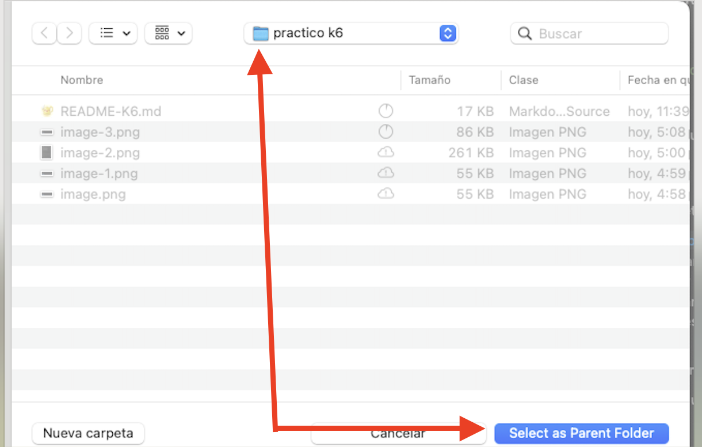

# copilot-q-k6
Este es un practico orientado a poder crear test de performance con el uso de github Copilot. De esta forma podemos crear nuestro marco de trabajo e ir adaptándolo a nuestras necesides con GitHubCopilot


# Adoption Copilot QA

## Descripción
Adoption Copilot es una herramienta diseñada para facilitar y automatizar procesos de prueba y desarrollo, integrando inteligencia artificial a través de GitHub Copilot, para mejorar la eficiencia y precisión en la creación de casos de prueba de rendimiento y escenarios de automatización. Esta herramienta está orientada a testers que buscan optimizar los tiempos al momento de tener que crear script de pruebas sobre rendimientos de aplicaciones.

## Alcance del Programa
1. Crearemos un framework de pruebas de rendimiento en K6 desde 0
2. Crearemos 4 test de rendimiento (Smoke, Load, Stress, Spike) para K6
3. Generaremos un archivo de datos con las opciones de prueba para utilizar en los diferentes test que tenemos
4. Generaremos un comando de ejecución para cada uno de los test de rendimiento
5. Generaremos un reporte de pruebas de rendimiento en K6
6. Utilizaremos los commands de GitHub Copilot para la creación de los test de rendimiento @workspace y #file


## Políticas de Branching para resolver los ejercicios del programa Adoption Copilot

- **Branch Principal (`main`):**
    - Contiene siempre la versión más actualizada del `README.md`.
- **Ramas de Hands-On Resuelto (`solved`):**
    - Para este ejecicio realizaremos la creación de una branch con el prefijo `copilot`.
    - Ejemplo: `copilot/feature<nombre de la feature realizada>`, la cual será creada a partir de la branch `copilot_practico`.

## Pre-Requisitos / Instalación

### Pre-Requisitos
- [**k6**](https://dl.k6.io/msi/k6-latest-amd64.msi) instalar en windows
- ```bash brew install k6 ``` instalar en mac
- **Git** instalado para el control de versiones.
- Acceso a las siguientes páginas web para propósitos de prueba:
- [Test.k6.io](https://test.k6.io/)

### Configuración del Proyecto con GitHub
    Para esto hay que tener un conocimiento previo de GitHub
1. **Clonar el repositorio remoto:**
   ```bash
   git clone https://github.com/CleveritDemo/copilot-qa-k6.git
   ```
2. **Cambiar la rama:**
   ```bash
   git checkout copilot_practico_k6
   ```
3. **Validar que tenemos instalado K6:**
   ```bash
   k6 version
   ``` 

## Pasos para Realizar el Hands-On

### 1. **Configuración Inicial:**
Asegúrate de haber completado todos los pasos de instalación y pre-requisitos.

### 2. **Pasos:**

***
### 2.1 **Creación la estructura base del proyecto:**
Crearemos el proyecto de pruebas de performance para generar casos de prueba mediante la utilización de Github Copilot dentro de nuestro marco de trabajo.
Con este ejercicio vamos a solicitar en nuestro chat de GitHub Copilot la generación de un framework de pruebas de performance en K6 y estaremos analizando la respuesta que nos retorna la IA respecto a esta solicitud.
***
- #### Ejercicio 1: ***crear la estructura del proyecto***
1.  #### Enviar el siguiente promts
```bash
Necesito crear una estructura de directorios organizados para utilizar en un  proyecto en k6
```
2. ####  Respuesta de Copilot:
`SIEMPRE` es necesario revisar las soluciones que nos brinda como resultado la IA, porque no todos los resultados son correctos o útiles para nuestras necesidades. En este caso, como podemos observar, la escructura del proyecto la estructura del proyecto creado y que tenga sentido y que los archivos propuestos sean los que necesitamos para realizar las pruebas de performance.


En este resultado podemos observar como son indica como tentativamente puede estar conformado nuestro marco de trabajo para este tipo de pruebas, pero la realidad es que nosotros seguramente tendremos una idea de como queremos la estructura de nuestro proyecto, por lo que va a ser necesario que nosostros tengamos definido esta estructura previamente para poder dar estos datos como parte del promtms que vamos a enviar a copilot.

***
- #### Ejercicio 2: ***crear la base estructura del proyecto con más especificaciones y utilizando el command `@workspace /new`***
 Objetivo del ejercicio: 
Con este ejercicio vamos a realizar la consulta a nuestro chat de copilot y analizar la respuesta nos devuelve copilot y detallamos que directorios debe de tener el proyecto.
Para realizar este ejercicio estaremos empleando los commands de Github Copilot `@workspace` y `/new`.
 

 1. Enviar el siguiente promts
```bash
@workspace /new Necesito crear una estructura de directorios organizados para generar un proyecto de performance con k6 de la siguiente forma:
    1. performance: Carpeta principal del proyecto			
    2. config: Carpeta donde se guardaran las opciones de prueba.
    3. data: Carpeta donde se guardaran los archivos de datos.
    4. reports: Carpeta donde se guardarán los reportes.    
    5. tests: Carpeta donde se guardarán los test.
```

2. ####  Respuesta de Copilot:
Luego de revisar la respuesta, procedemos a crear el framework sugerido en la respuesta haciendo click en el botón de `Crear área de trabajo`
    


3. Crear el proyecto dentro de la misma ruta o carpeta donde tenemos el readme de este practico.



Claro, aquí tienes una propuesta de estructura de directorios para un proyecto de pruebas de rendimiento k6:
Hay que darle clic en `**Crear espacio de trabajo**` y se selecciona la carpeta donde se va crear el proyecto

4. #### Reflexiones sobre el ejercicio:
Como podemos observar para esta consulta, el resultado de la misma fue el esperado por nosotros ya que al revisar la respuesta, nos retorno los directorios con la estrutura deseada. Es importante destacar que va a depender de lo que nosotros tengamos definido para nuestra base de proyecto y de como queramos implementarlo, lo que conlleva a que si o si el conocimiento de la persona que realiza esta actividad debe estar presente para que pueda asegurarse de que cada respuesta cumpla con la necesidad.
Es importante acotar que para este ejecicio nos apoyamos del commands @workspace y de /new, cualidad que nos permite obtener en la respuesta la creación del framework solicitado y nos genero el botón de acceso a crear el framework en la carpeta donde se encuentra el readme de este practico.

### 2.2 **Creación de Casos de Prueba (Smoke Test):**
Utilizaremos la estructura creada anteriormente, para solicitar la generación de un caso de prueba mediante la utilización de Github Copilot dentro de nuestro marco de trabajo.


Con este paso vamos  indicarle que nos genere un test de tipo smoke, para lo cual le estaremos indicando todas las especificaciones necesarias y que se ajustan a nuestra necesidad.
Acompañaremos este promtms con el commands de GitHub Copilot @workspace para que tome el contexto de la estrutura que creamos en el paso anterior asi como de la lista de especificaciones
debe de crear una caso de prueba de smoke test y vamos a analizar la respuesta que devuelve copilot.

1. Enviar el siguiente promts:

  ```bash
    @workspace Crea un test con el nombre smoke-test.js en k6 para un prueba de humo que:
    1. Sea sobre la siguiente url: https://test.k6.io
    2. Configura 1 usuario
    3. La duración debe ser de 60 segundos
    4. El 95% de las solicitudes deben completarse en menos de 2s 
    5. Validamos el código de respuesta sea 200 
    6. El tiempo de respuesta inferior a 250ms.
   ```

2. ####  Respuesta de Copilot:
Como podemos observar la respuesta que nos ha sugerido con el siguiente test se corresponde con lo que hemos solicitado en el promtms, por lo que podemos proceder a copiar el código y pegarlo en nuestro archivo de test.
- Podemos detallar que refiere a la URL que le indicamos en el promtms.
- Que esta configurado para  1 usuario.
- Que la duración de la prueba es de 10 segundo tal y como le indicamos.
- El porcentaje de solicitudes deben completarse en menos de 2s.
- Que agrego la validacion del status code y que el tiempo de respuesta es de 250ms.

```bash 
**Código**
1. Crear el archivo smoke-test.js en la carpeta tests de tu proyecto. Luego, agrega el siguiente código:

 ```bash
import http from 'k6/http';
import { check, sleep } from 'k6';

export const options = {
    vus: 1, // 1 usuario
    duration: '60s', // duración de 60 segundos
    thresholds: {
        http_req_duration: ['p(95)<2000'], // el 95% de las solicitudes deben completarse en menos de 2s
    },
};

export default function () {
    const res = http.get('https://test.k6.io');
    check(res, {
        'status is 200': (r) => r.status === 200, // validamos el código de respuesta 200
        'response time is less than 250ms': (r) => r.timings.duration < 250, // tiempo de respuesta inferior a 250ms
    });
    sleep(1);
}
   ```

#### 2.3 ***Generamos el comando de ejecución del test usando el @workspace y el #file***
Con este paso vamos a generar solicitar a copilot que nos genere el comando de ejecución del archivo que acabamos de crear en el paso anterior.

1. Enviar el siguiente promts:  
  ```bash
    @workspace Genera el comando de ejecución del archivo #file:smoke-test.js
   ```

2. ####  Respuesta de Copilot:
 ```bash
k6 run performance/tests/smoke-test.js
   ```  

Como podemos observar en esta respuesta, la IA nos ha generado el comando de ejecución del archivo que acabamos de crear en el paso anterior, por lo que podemos proceder a copiar el comando y pegarlo en nuestra terminal para ejecutar el test.
Para ejecutar el comando podemos hacer copiar y pegarlo en la terminal o tambien podemos hacer click dentro del icono de la terminal dentro de la respuesta y esto nos insertara de manera automatica dicho comando para su ejecución.


### 2.4 **Creación de Casos de prueba de tipo Load Test:**
Utilizaremos la estructura creada anteriormente, para solicitar la generación de un caso de prueba mediante la utilización de Github Copilot dentro de nuestro marco de trabajo.

Con este paso vamos  indicarle que nos genere un test de tipo load, para lo cual le estaremos indicando todas las especificaciones necesarias y que se ajustan a nuestra necesidad.
Acompañaremos este promtms con el commands de GitHub Copilot @workspace para que tome el contexto de la estrutura que creamos en el paso anterior asi como de la lista de especificaciones
debe de crear una caso de prueba de smoke test y vamos a analizar la respuesta que devuelve copilot.

1. Enviar el siguiente promts:

  ```bash
@workspace Crea un test con el nombre load -test.js en k6 que:
      1. Configure las siguientes etapas:
      2. 60 segundos de duración con un objetivo de 10 usuarios.
      3. 120 segundos de duración manteniendo 10 usuarios.
      4. 60 segundos de duración reduciendo a 0 usuarios.
      5. Realice una solicitud POST a la URL:  https://jsonplaceholder.typicode.com/posts/ 
      6. Que se envíe el siguiente body en cada una de las solicitudes:
{
    "userId": ${userId},
    "title": "${title}",
    "body": "${body}"
}
      7. Que los valores de userId, title y body sean dinámicos para cada unos de los usuarios de esta prueba.
      8. Incluya un tiempo de espera de 1 segundo después de la solicitud.
      9. Validamos el código de respuesta sea 201
      10. El tiempo de respuesta inferior a 350ms.
      11. El 97% de las solicitudes deben completarse en menos de 2s 

```

2. ####  Respuesta de Copilot:
```bash 
**Código**
1. Crear el archivo smoke-test.js en la carpeta tests de tu proyecto. Luego, agrega el siguiente código:

 ```bash
import http from 'k6/http';
import { check, sleep } from 'k6';
import { randomIntBetween, randomString } from 'https://jslib.k6.io/k6-utils/1.1.0/index.js';

export const options = {
    stages: [
        { duration: '60s', target: 10 }, // 60 segundos de duración con un objetivo de 10 usuarios
        { duration: '120s', target: 10 }, // 120 segundos de duración manteniendo 10 usuarios
        { duration: '60s', target: 0 }, // 60 segundos de duración reduciendo a 0 usuarios
    ],
};

export default function () {
    const userId = randomIntBetween(1, 100);
    const title = randomString(10);
    const body = randomString(50);

    const payload = JSON.stringify({
        userId: userId,
        title: title,
        body: body,
    });

    const params = {
        headers: {
            'Content-Type': 'application/json',
        },
    };

    const res = http.post('https://jsonplaceholder.typicode.com/posts', payload, params);

    check(res, {
        'status is 201': (r) => r.status === 201, // validamos el código de respuesta 201
        'response time is less than 350ms': (r) => r.timings.duration < 350, // tiempo de respuesta inferior a 350ms
    });

    sleep(1); // tiempo de espera de 1 segundo después de la solicitud
}
```
Como podemos observar la respuesta que nos ha sugerido con el siguiente test de carga o load, se corresponde con lo que hemos solicitado en el promtms, por lo que podemos proceder a copiar el código y pegarlo en nuestro archivo de test.
- Podemos detallar que refiere a la URL que le indicamos en el promtms.
- Que esta configurado para la cantidad de usuarios que le indicamos por tiempo de duración.
- El porcentaje de solicitudes deben completarse en menos de 2s.
- Que incluya un tiempo de espera entre las solicitudes.
- Que agrego la validacion del status code y que el tiempo de respuesta es de 350ms.
- Genero un metodo para generar valores dinamicos para los campos userId, title y body.
- Se envie un body en cada una de las solicitudes diferente para cada usuario.

3. Generamos el comando de ejecución del test usando el @workspace y el #file
Con este paso vamos a generar solicitar a copilot que nos genere el comando de ejecución del archivo que acabamos de crear en el paso anterior.

1. [x] Enviar el siguiente promts:
  ```bash
    @workspace Genera el comando de ejecución del archivo #file:load-test.js
   ```

2. [x] Respuesta de Copilot:
 ```bash
k6 run performance/tests/load-test.js
   ```

### 2.5 **Creación de Casos de prueba de tipo Stress Test:**
Utilizaremos la estructura creada anteriormente, para solicitar la generación de un caso de prueba mediante la utilización de Github Copilot dentro de nuestro marco de trabajo.

Con este paso vamos  indicarle que nos genere un test de tipo Stress, para lo cual le estaremos indicando todas las especificaciones necesarias y que se ajustan a nuestra necesidad.
Acompañaremos este promtms con el commands de GitHub Copilot @workspace para que tome el contexto de la estrutura que creamos en el paso anterior asi como de la lista de especificaciones
debe de crear una caso de prueba de smoke test y vamos a analizar la respuesta que devuelve copilot.

1. Enviar el siguiente promts:

  ```bash
@workspace Crea un test con el nombre stress-test.js en k6 que:
1. Configure las siguientes etapas:
    - 60 segundos de duración con un objetivo de 20 usuarios.
    - 180 segundos de duración manteniendo 20 usuarios.
    - 30 segundos de duración reduciendo a 0 usuarios.
2. Realice una solicitud GET a la URL: https://test-api.k6.io
3. Incluya un tiempo de espera de 1 segundo después de la solicitud.
4. Validamos el código de respuesta sea 200 
5. El tiempo de respuesta inferior a 250ms.       
```

2. ####  Respuesta de Copilot:

Código
Crear el archivo smoke-test.js en la carpeta tests de tu proyecto. Luego, agrega el siguiente código:


 ```bash
import http from 'k6/http';
import { check, sleep } from 'k6';

export const options = {
    stages: [
        { duration: '60s', target: 20 }, // 60 segundos de duración con un objetivo de 20 usuarios
        { duration: '180s', target: 20 }, // 180 segundos de duración manteniendo 20 usuarios
        { duration: '30s', target: 0 }, // 30 segundos de duración reduciendo a 0 usuarios
    ],
};

export default function () {
    const res = http.get('https://test-api.k6.io');
    check(res, {
        'status is 200': (r) => r.status === 200, // validamos el código de respuesta 200
        'response time is less than 350ms': (r) => r.timings.duration < 250, // tiempo de respuesta inferior a 350ms
    });
    sleep(1); // tiempo de espera de 1 segundo después de la solicitud
}
```

3. Generamos el comando de ejecución del test usando el @workspace y el #file
Con este paso vamos a generar solicitar a copilot que nos genere el comando de ejecución del archivo que acabamos de crear en el paso anterior.
1. [x] Enviar el siguiente promts:
  ```bash
    @workspace Genera el comando de ejecución del archivo #file:stress-test.js
   ```
2. [x] Respuesta de Copilot:
 ```bash
k6 run performance/tests/stress-test.js
   ```
4. Reflexiones sobre el ejercicio:

Como podemos observar la respuesta que nos ha sugerido con el siguiente test de carga o load, se corresponde con lo que hemos solicitado en el promtms, por lo que podemos proceder a copiar el código y pegarlo en nuestro archivo de test.
- Podemos detallar que refiere a la URL que le indicamos en el promtms.
- Que esta configurado para la cantidad de usuarios que le indicamos por tiempo de duración.
- El porcentaje de solicitudes deben completarse en menos de 2s.
- Que incluya un tiempo de espera entre las solicitudes.
- Que agrego la validacion del status code y que el tiempo de respuesta es de 250ms.

### 2.6 **Creación de Casos de prueba de tipo Spike Test:**
Utilizaremos la estructura creada anteriormente, para solicitar la generación de un caso de prueba mediante la utilización de Github Copilot dentro de nuestro marco de trabajo.

Con este paso vamos  indicarle que nos genere un test de tipo Spike, para lo cual le estaremos indicando todas las especificaciones necesarias y que se ajustan a nuestra necesidad.
Acompañaremos este promtms con el commands de GitHub Copilot @workspace para que tome el contexto de la estrutura que creamos en el paso anterior asi como de la lista de especificaciones
debe de crear una caso de prueba de smoke test y vamos a analizar la respuesta que devuelve copilot.

1. Enviar el siguiente promts:

  ```bash
@workspace Crea un test con el nombre spike -test.js en k6 que:
1.	Configure las siguientes etapas:
2.	60 segundos de duración con un objetivo de 20 usuarios.
3.	30 segundos de duración reduciendo 0 usuarios.
4.	60 segundos de duración manteniendo 20 usuarios.
5.	30 segundos de duración reduciendo 0 usuarios.
6.	60 segundos de duración manteniendo 20 usuarios.
7.	30 segundos de duración reduciendo 0 usuarios.
8.	Realice una solicitud POST a la URL:  https://jsonplaceholder.typicode.com/posts/ 
9.	Que se envíe el siguiente body en cada una de las solicitudes:
{
    "userId": ${userId},
    "title": "${title}",
    "body": "${body}"
}
10.	Que los valores de userId, title y body sean dinámicos para cada unos de los usuarios de esta prueba.
11.	Validamos el código de respuesta sea 201
12.	El tiempo de respuesta inferior a 200ms.
      
```

2. ####  Respuesta de Copilot:

Código
Crear el archivo smoke-test.js en la carpeta tests de tu proyecto. Luego, agrega el siguiente código:


 ```bash
import http from 'k6/http';
import { check, sleep } from 'k6';
import { randomIntBetween, randomString } from 'https://jslib.k6.io/k6-utils/1.1.0/index.js';

export const options = {
    stages: [
        { duration: '60s', target: 20 }, // 60 segundos de duración con un objetivo de 20 usuarios
        { duration: '30s', target: 0 }, // 30 segundos de duración reduciendo a 0 usuarios
        { duration: '60s', target: 20 }, // 60 segundos de duración manteniendo 20 usuarios
        { duration: '30s', target: 0 }, // 30 segundos de duración reduciendo a 0 usuarios
        { duration: '60s', target: 20 }, // 60 segundos de duración manteniendo 20 usuarios
        { duration: '30s', target: 0 }, // 30 segundos de duración reduciendo a 0 usuarios
    ],
};

export default function () {
    const userId = randomIntBetween(1, 100);
    const title = randomString(10);
    const body = randomString(50);

    const payload = JSON.stringify({
        userId: userId,
        title: title,
        body: body,
    });

    const params = {
        headers: {
            'Content-Type': 'application/json',
        },
    };

    const res = http.post('https://jsonplaceholder.typicode.com/posts', payload, params);

    check(res, {
        'status is 201': (r) => r.status === 201, // validamos el código de respuesta 201
        'response time is less than 200ms': (r) => r.timings.duration < 200, // tiempo de respuesta inferior a 200ms
    });

    sleep(1); // tiempo de espera de 1 segundo después de la solicitud
}
```

3. Generamos el comando de ejecución del test usando el @workspace y el #file
Con este paso vamos a generar solicitar a copilot que nos genere el comando de ejecución del archivo que acabamos de crear en el paso anterior.
1. [x] Enviar el siguiente promts:
  ```bash
    @workspace Genera el comando de ejecución del archivo #file:spike-test.js
   ```
2. [x] Respuesta de Copilot:
 ```bash
k6 run performance/tests/spike-test.js
```
4. Reflexiones sobre el ejercicio:

Como podemos observar la respuesta que nos ha sugerido con el siguiente test de carga o load, se corresponde con lo que hemos solicitado en el promtms, por lo que podemos proceder a copiar el código y pegarlo en nuestro archivo de test.
- Podemos detallar que refiere a la URL que le indicamos en el promtms.
- Que esta configurado para la cantidad de usuarios que le indicamos por tiempo de duración.
- Que agrego la validacion del status code y que el tiempo de respuesta es de 200ms.


### 2.7 **Creación de archivo de configuración para los test de rendimiento:**
Utilizaremos las pruebas creadas para crear un archivos de configuración, que agrupe en diferentes constantes los valores de los diferentes target de duración de cada test.
También le solicitaremos que nos realice la modificación dentro de los test para que puede obtener del archivo de configuración esta información.
***

1. Enviar el siguiente promts:
  ```bash
   @workspace crear un archivo de configuración con el nombre config-test-options.js:
1.  Dentro del directorio config donde puedes definir diferentes configuraciones de prueba para utilizar en los diferentes test que tenemos #file:smoke-test.js #file:load-test.js #file:stress-test.js #file:spike-test.js para:
2.	Crear una función con el nombre getTestOptions y que tenga una variable para enviarle el tipo de test con las configuraciones de duración por tipo de test.
3.	Realizar la modificación en cada test de esta constante.
   ```

2. ####  Respuesta de Copilot:

Claro, aquí tienes el código para el archivo `config-test-options.js` en la carpeta `config` de tu proyecto:
 ```bash
// performance/config/config-test-options.js

export const smokeTestOptions = {
    vus: 1, // 1 usuario
    duration: '10s', // duración de 10 segundos
    thresholds: {
        http_req_duration: ['p(95)<2000'], // el 95% de las solicitudes deben completarse en menos de 2s
    },
};

export const loadTestOptions = {
    stages: [
        { duration: '60s', target: 10 }, // 60 segundos de duración con un objetivo de 10 usuarios
        { duration: '120s', target: 10 }, // 120 segundos de duración manteniendo 10 usuarios
        { duration: '60s', target: 0 }, // 60 segundos de duración reduciendo a 0 usuarios
    ],
};

export const stressTestOptions = {
    stages: [
        { duration: '60s', target: 20 }, // 60 segundos de duración con un objetivo de 20 usuarios
        { duration: '180s', target: 20 }, // 180 segundos de duración manteniendo 20 usuarios
        { duration: '30s', target: 0 }, // 30 segundos de duración reduciendo a 0 usuarios
    ],
};

export const spikeTestOptions = {
    stages: [
        { duration: '60s', target: 20 }, // 60 segundos de duración con un objetivo de 20 usuarios
        { duration: '30s', target: 0 }, // 30 segundos de duración reduciendo a 0 usuarios
        { duration: '60s', target: 20 }, // 60 segundos de duración manteniendo 20 usuarios
        { duration: '30s', target: 0 }, // 30 segundos de duración reduciendo a 0 usuarios
        { duration: '60s', target: 20 }, // 60 segundos de duración manteniendo 20 usuarios
        { duration: '30s', target: 0 }, // 30 segundos de duración reduciendo a 0 usuarios
    ],
};

export function getTestOptions(testType) {
    switch (testType) {
        case 'smoke':
            return smokeTestOptions;
        case 'load':
            return loadTestOptions;
        case 'stress':
            return stressTestOptions;
        case 'spike':
            return spikeTestOptions;
        default:
            throw new Error(`Unknown test type: ${testType}`);
    }
}
```

Ahora, realiza la modificación en cada test para utilizar esta configuración:

`smoke-test.js`

 ```bash
import http from 'k6/http';
import { check, sleep } from 'k6';
import { getTestOptions } from '../config/config-test-options.js';

export const options = getTestOptions('smoke');

export default function () {
    const res = http.get('https://test.k6.io');
    check(res, {
        'status is 200': (r) => r.status === 200, // validamos el código de respuesta 200
        'response time is less than 250ms': (r) => r.timings.duration < 250, // tiempo de respuesta inferior a 250ms
    });
    sleep(1);
}
```

`load-test.js`

 ```bash
import http from 'k6/http';
import { check, sleep } from 'k6';
import { randomIntBetween, randomString } from 'https://jslib.k6.io/k6-utils/1.1.0/index.js';
import { getTestOptions } from '../config/config-test-options.js';

export const options = getTestOptions('load');

export default function () {
    const userId = randomIntBetween(1, 100);
    const title = randomString(10);
    const body = randomString(50);

    const payload = JSON.stringify({
        userId: userId,
        title: title,
        body: body,
    });

    const params = {
        headers: {
            'Content-Type': 'application/json',
        },
    };

    const res = http.post('https://jsonplaceholder.typicode.com/posts', payload, params);

    check(res, {
        'status is 201': (r) => r.status === 201, // validamos el código de respuesta 201
        'response time is less than 350ms': (r) => r.timings.duration < 350, // tiempo de respuesta inferior a 350ms
    });

    sleep(1); // tiempo de espera de 1 segundo después de la solicitud
}
```

`stress-test.js`

 ```bash
import http from 'k6/http';
import { check, sleep } from 'k6';
import { getTestOptions } from '../config/config-test-options.js';

export const options = getTestOptions('stress');

export default function () {
    const res = http.get('https://test-api.k6.io');
    check(res, {
        'status is 200': (r) => r.status === 200, // validamos el código de respuesta 200
        'response time is less than 350ms': (r) => r.timings.duration < 350, // tiempo de respuesta inferior a 350ms
    });
    sleep(1); // tiempo de espera de 1 segundo después de la solicitud
}
```

`spike-test.js`

 ```bash
import http from 'k6/http';
import { check, sleep } from 'k6';
import { randomIntBetween, randomString } from 'https://jslib.k6.io/k6-utils/1.1.0/index.js';
import { getTestOptions } from '../config/config-test-options.js';

export const options = getTestOptions('spike');

export default function () {
    const userId = randomIntBetween(1, 100);
    const title = randomString(10);
    const body = randomString(50);

    const payload = JSON.stringify({
        userId: userId,
        title: title,
        body: body,
    });

    const params = {
        headers: {
            'Content-Type': 'application/json',
        },
    };

    const res = http.post('https://jsonplaceholder.typicode.com/posts', payload, params);

    check(res, {
        'status is 201': (r) => r.status === 201, // validamos el código de respuesta 201
        'response time is less than 200ms': (r) => r.timings.duration < 200, // tiempo de respuesta inferior a 200ms
    });

    sleep(1); // tiempo de espera de 1 segundo después de la solicitud
}
```
3.- Rexlexiones sobre el ejercicio:

Como podemos observar nos ha sugerido la totalidad de la configuración que necesitamos para los test de rendimiento, asi como la modificación que debemos realizar en cada uno de los test para que pueda obtener del archivo de configuración esta información.
De esta forma podremos ir agregando a nuestro entorno de trabajo la escalabilidad necesaria para un mantenimiento adecuando.


### 2.8 **Creación de archivo de datos para los test de performance:**
Solicitaremos a la IA que nos ayude a crear un archivo de datos dentro del directorio que corresponde para poder concentrar en un solo lugar los datos que necesitamos para realizar las pruebas, como por ejemplos los body de los request que vamos a realizar o las urls que utlicemos en los test.
***

1. Enviar el siguiente promts:
  ```bash
   @workspace crear un archivo de configuración con el nombre config-test-options.js:
1.  Dentro del directorio config donde puedes definir diferentes configuraciones de prueba para utilizar en los diferentes test que tenemos #file:smoke-test.js #file:load-test.js #file:stress-test.js #file:spike-test.js para:
2.	Crear una función con el nombre getTestOptions y que tenga una variable para enviarle el tipo de test con las configuraciones de duración por tipo de test.
3.	Realizar la modificación en cada test de esta constante.
   ```

2. ####  Respuesta de Copilot:

@workspace crear un archivo de datos con el nombre `data-test.js`:

1. Dentro del directorio data donde se pueda tener dentro una constante la configuración del body del request de los test `#file:smoke-test.js` `#file:load-test.js` `#file:stress-test.js` `#file:spike-test.js`
2. Crear una función con el nombre getTestData y que tenga una variable para enviarle al test los datos del request 
3. Crear una constante para agrupar las diferentes urls que se utilizan en los test
Realizar la modificación en cada test de estas constantes.

Claro, aquí tienes el código para el archivo `data-test.js` en la carpeta `data` de tu proyecto:
 ```bash
// performance/data/data-test.js

import { randomIntBetween, randomString } from 'https://jslib.k6.io/k6-utils/1.1.0/index.js';

export const urls = {
    smokeTestUrl: 'https://test.k6.io',
    loadTestUrl: 'https://jsonplaceholder.typicode.com/posts',
    stressTestUrl: 'https://test-api.k6.io',
    spikeTestUrl: 'https://jsonplaceholder.typicode.com/posts',
};

export function getTestData() {
    const userId = randomIntBetween(1, 100);
    const title = randomString(10);
    const body = randomString(50);

    return JSON.stringify({
        userId: userId,
        title: title,
        body: body,
    });
}
```

Ahora, realiza la modificación en cada test para utilizar esta configuración:

`smoke-test.js`

 ```bash
import http from 'k6/http';
import { check, sleep } from 'k6';
import { getTestOptions } from '../config/config-test-options.js';
import { urls } from '../data/data-test.js';

export const options = getTestOptions('smoke');

export default function () {
    const res = http.get(urls.smokeTestUrl);
    check(res, {
        'status is 200': (r) => r.status === 200, // validamos el código de respuesta 200
        'response time is less than 250ms': (r) => r.timings.duration < 250, // tiempo de respuesta inferior a 250ms
    });
    sleep(1);
}
```

`load-test.js`

 ```bash
import http from 'k6/http';
import { check, sleep } from 'k6';
import { getTestOptions } from '../config/config-test-options.js';
import { getTestData, urls } from '../data/data-test.js';

export const options = getTestOptions('load');

export default function () {
    const payload = getTestData();

    const params = {
        headers: {
            'Content-Type': 'application/json',
        },
    };

    const res = http.post(urls.loadTestUrl, payload, params);

    check(res, {
        'status is 201': (r) => r.status === 201, // validamos el código de respuesta 201
        'response time is less than 350ms': (r) => r.timings.duration < 350, // tiempo de respuesta inferior a 350ms
    });

    sleep(1); // tiempo de espera de 1 segundo después de la solicitud
}
```

`stress-test.js`

 ```bash
import http from 'k6/http';
import { check, sleep } from 'k6';
import { getTestOptions } from '../config/config-test-options.js';
import { urls } from '../data/data-test.js';

export const options = getTestOptions('stress');

export default function () {
    const res = http.get(urls.stressTestUrl);
    check(res, {
        'status is 200': (r) => r.status === 200, // validamos el código de respuesta 200
        'response time is less than 350ms': (r) => r.timings.duration < 350, // tiempo de respuesta inferior a 350ms
    });
    sleep(1); // tiempo de espera de 1 segundo después de la solicitud
}
```

`spike-test.js`

 ```bash
import http from 'k6/http';
import { check, sleep } from 'k6';
import { getTestOptions } from '../config/config-test-options.js';
import { getTestData, urls } from '../data/data-test.js';

export const options = getTestOptions('spike');

export default function () {
    const payload = getTestData();

    const params = {
        headers: {
            'Content-Type': 'application/json',
        },
    };

    const res = http.post(urls.spikeTestUrl, payload, params);

    check(res, {
        'status is 201': (r) => r.status === 201, // validamos el código de respuesta 201
        'response time is less than 200ms': (r) => r.timings.duration < 200, // tiempo de respuesta inferior a 200ms
    });

    sleep(1); // tiempo de espera de 1 segundo después de la solicitud
}
```
3.- Rexlexiones sobre el ejercicio:

Como podemos observar nos ha sugerido en la solución propuesta variabilizar el body de los request de los test, asi como las urls que se utilizan, de esta forma podremos ir agregando a nuestro entorno de trabajo la escalabilidad necesaria para un mantenimiento adecuando.


### 2.9 **Configuración de reportes para los test de rendimiento**
Utilizaremos los test creados para configurar los reportes mediante la utilización de Github Copilot dentro de nuestro marco de trabajo.

Con este paso vamos a realizar la consulta para agregar la configuración de los reportes.
  
  ```bash
  @workspace configura el reporte htmlReport y textSummary:
1.	En los diferentes test #file:smoke-test.js  #file:load-test.js #file:stress-test.js #file:spike-test.js 
2.	El output del reporte se muestre en el directorio reports
3.  El nombre del reporte que incluya la fecha de ejecución

   ```

- ####  Respuesta de Copilot:

Claro, aquí tienes la configuración del reporte `htmlReport` y `textSummary` en los diferentes tests para que la salida del reporte se muestre en el directorio `reports`:
Ahora, realiza la modificación en cada test para utilizar esta configuración:

`smoke-test.js`

 ```bash
import http from 'k6/http';
import { check, sleep } from 'k6';
import { getTestOptions } from '../config/config-test-options.js';
import { urls } from '../data/data-test.js';
import { htmlReport } from 'https://raw.githubusercontent.com/benc-uk/k6-reporter/main/dist/bundle.js';
import { textSummary } from 'https://jslib.k6.io/k6-summary/0.0.1/index.js';

export const options = getTestOptions('smoke');

export default function () {
    const res = http.get(urls.smokeTestUrl);
    check(res, {
        'status is 200': (r) => r.status === 200, // validamos el código de respuesta 200
        'response time is less than 250ms': (r) => r.timings.duration < 250, // tiempo de respuesta inferior a 250ms
    });
    sleep(1);
}

export function handleSummary(data) {
    return {
        'performance/reports/smoke-summary.html': htmlReport(data),
        'performance/reports/smoke-summary.txt': textSummary(data),
    };
}
```

`load-test.js`

 ```bash
import http from 'k6/http';
import { check, sleep } from 'k6';
import { getTestOptions } from '../config/config-test-options.js';
import { getTestData, urls } from '../data/data-test.js';
import { htmlReport } from 'https://raw.githubusercontent.com/benc-uk/k6-reporter/main/dist/bundle.js';
import { textSummary } from 'https://jslib.k6.io/k6-summary/0.0.1/index.js';

export const options = getTestOptions('load');

export default function () {
    const payload = getTestData();

    const params = {
        headers: {
            'Content-Type': 'application/json',
        },
    };

    const res = http.post(urls.loadTestUrl, payload, params);

    check(res, {
        'status is 201': (r) => r.status === 201, // validamos el código de respuesta 201
        'response time is less than 350ms': (r) => r.timings.duration < 350, // tiempo de respuesta inferior a 350ms
    });

    sleep(1); // tiempo de espera de 1 segundo después de la solicitud
}

export function handleSummary(data) {
    return {
        'performance/reports/load-summary.html': htmlReport(data),
        'performance/reports/load-summary.txt': textSummary(data),
    };
}
```


`stress-test.js`

 ```bash
import http from 'k6/http';
import { check, sleep } from 'k6';
import { getTestOptions } from '../config/config-test-options.js';
import { urls } from '../data/data-test.js';
import { htmlReport } from 'https://raw.githubusercontent.com/benc-uk/k6-reporter/main/dist/bundle.js';
import { textSummary } from 'https://jslib.k6.io/k6-summary/0.0.1/index.js';

export const options = getTestOptions('stress');

export default function () {
    const res = http.get(urls.stressTestUrl);
    check(res, {
        'status is 200': (r) => r.status === 200, // validamos el código de respuesta 200
        'response time is less than 350ms': (r) => r.timings.duration < 350, // tiempo de respuesta inferior a 350ms
    });
    sleep(1); // tiempo de espera de 1 segundo después de la solicitud
}

export function handleSummary(data) {
    return {
        'performance/reports/stress-summary.html': htmlReport(data),
        'performance/reports/stress-summary.txt': textSummary(data),
    };
}
```

`spike-test.js`

 ```bash
import http from 'k6/http';
import { check, sleep } from 'k6';
import { getTestOptions } from '../config/config-test-options.js';
import { getTestData, urls } from '../data/data-test.js';
import { htmlReport } from 'https://raw.githubusercontent.com/benc-uk/k6-reporter/main/dist/bundle.js';
import { textSummary } from 'https://jslib.k6.io/k6-summary/0.0.1/index.js';

export const options = getTestOptions('spike');

export default function () {
    const payload = getTestData();

    const params = {
        headers: {
            'Content-Type': 'application/json',
        },
    };

    const res = http.post(urls.spikeTestUrl, payload, params);

    check(res, {
        'status is 201': (r) => r.status === 201, // validamos el código de respuesta 201
        'response time is less than 200ms': (r) => r.timings.duration < 200, // tiempo de respuesta inferior a 200ms
    });

    sleep(1); // tiempo de espera de 1 segundo después de la solicitud
}

export function handleSummary(data) {
    return {
        'performance/reports/spike-summary.html': htmlReport(data),
        'performance/reports/spike-summary.txt': textSummary(data),
    };
}
```
3.- Rexlexiones sobre el ejercicio:

Como podemos observar nos ha sugerido en la solución propuesta la configuración de los reportes para los test de rendimiento, asi como la modificación que debemos realizar en cada uno de los test para que pueda obtener del archivo de configuración esta información.

***
