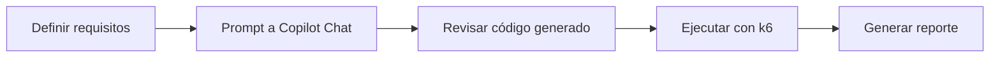

<div align="center">


  # 🚀 Copilot QA — Framework de Pruebas de Rendimiento con k6

  [](https://github.com/features/copilot)
  [](https://k6.io/)
  [](https://developer.mozilla.org/docs/Web/JavaScript)
  [](https://code.visualstudio.com/)

  **🌐 Idioma:** **Español** · [English](./README_ENG.md)

</div>

---

**Esta capacitación práctica** te enseña a **crear un framework de pruebas de rendimiento en k6 desde cero** usando **GitHub Copilot**. Crearás los cuatro tipos de pruebas de rendimiento canónicos (**Smoke, Load, Stress, Spike**), centralizarás las opciones de prueba y los datos de las solicitudes en archivos reutilizables, y generarás **reportes HTML y de texto** — todo impulsado por prompts de Copilot Chat.

> Para más información sobre las herramientas usadas en este taller, consulta la documentación oficial:
>
> - [GitHub Copilot Chat](https://docs.github.com/en/copilot/how-tos/use-copilot-chat)
> - [Documentación de Grafana k6](https://grafana.com/docs/k6/latest/)
> - [Tipos de prueba en k6 (Smoke, Load, Stress, Spike)](https://grafana.com/docs/k6/latest/testing-guides/test-types/)
> - [Opciones y Thresholds de k6](https://grafana.com/docs/k6/latest/using-k6/thresholds/)
> - [Reporter HTML de k6](https://github.com/benc-uk/k6-reporter)

---

## 📋 Tabla de Contenidos

1. [🎯 Objetivos de aprendizaje](#-objetivos-de-aprendizaje)
2. [⏱️ Duración estimada](#️-duración-estimada)
3. [📚 Requisitos previos](#-requisitos-previos)
4. [🌿 Política de ramas](#-política-de-ramas)
5. [🧩 Variables de GitHub Copilot utilizadas](#-variables-de-github-copilot-utilizadas)
6. [🗂️ Paso 1. Crear la estructura base del proyecto](#️-paso-1-crear-la-estructura-base-del-proyecto)
7. [💨 Paso 2. Smoke test (Prueba de humo)](#-paso-2-smoke-test-prueba-de-humo)
8. [📈 Paso 3. Load test (Prueba de carga)](#-paso-3-load-test-prueba-de-carga)
9. [🔥 Paso 4. Stress test (Prueba de estrés)](#-paso-4-stress-test-prueba-de-estrés)
10. [⚡ Paso 5. Spike test (Prueba de picos)](#-paso-5-spike-test-prueba-de-picos)
11. [⚙️ Paso 6. Archivo de configuración central](#️-paso-6-archivo-de-configuración-central)
12. [🗃️ Paso 7. Archivo de datos](#️-paso-7-archivo-de-datos)
13. [📊 Paso 8. Configurar reportes](#-paso-8-configurar-reportes)
14. [🧭 Reflexiones finales](#-reflexiones-finales)

---

## 🎯 Objetivos de aprendizaje

Al finalizar este taller serás capaz de:

- ✅ Generar una **estructura de proyecto k6** organizada con GitHub Copilot usando la variable `#new`.
- ✅ Crear cuatro tipos de pruebas de rendimiento — **Smoke, Load, Stress, Spike** — a partir de prompts en lenguaje natural.
- ✅ Generar el **comando de ejecución** de cada prueba usando `#codebase` y `#file`.
- ✅ Centralizar las opciones de prueba en un **archivo de configuración** (`config-test-options.js`).
- ✅ Centralizar los cuerpos de las solicitudes y las URLs en un **archivo de datos** (`data-test.js`).
- ✅ Producir **reportes HTML y de texto** con la fecha de ejecución en el directorio `reports/`.

> [!TIP]
> `SIEMPRE` revisá el código que sugiere Copilot. No todos los resultados son correctos o útiles para tus necesidades — tu conocimiento del dominio es lo que convierte una buena sugerencia en una gran prueba.

---

## ⏱️ Duración estimada

| Bloque                                          | Tiempo      |
| ----------------------------------------------- | ----------- |
| 📚 Configuración y requisitos previos           | 10 min      |
| 🗂️ Paso 1 - Estructura del proyecto             | 5 min       |
| 💨 Paso 2 - Smoke test                           | 10 min      |
| 📈 Paso 3 - Load test                            | 10 min      |
| 🔥 Paso 4 - Stress test                          | 10 min      |
| ⚡ Paso 5 - Spike test                           | 10 min      |
| ⚙️ Paso 6 - Archivo de configuración            | 10 min      |
| 🗃️ Paso 7 - Archivo de datos                     | 10 min      |
| 📊 Paso 8 - Reportes                             | 10 min      |
| **Total**                                       | **~85 min** |

---

## 📚 Requisitos previos

Antes de comenzar, asegurate de tener:

- [Grafana k6](https://grafana.com/docs/k6/latest/set-up/install-k6/) instalado:
  - Windows (instalador oficial): <https://dl.k6.io/msi/k6-latest-amd64.msi>
  - macOS (Homebrew): `brew install k6`
- [Git](https://git-scm.com/downloads) instalado para el control de versiones.
- [Visual Studio Code](https://code.visualstudio.com/).
- [GitHub Copilot](https://github.com/features/copilot) activo en VS Code (extensión + suscripción).
- Acceso a los siguientes endpoints de prueba:
  - <https://test.k6.io/>
  - <https://jsonplaceholder.typicode.com/posts/>

Verificá tu instalación:

```bash
k6 version
git --version
code --version
```

### Configuración del proyecto con GitHub

```bash
# 1. Clonar el repositorio remoto
git clone https://github.com/CleveritDemo/copilot-qa-k6.git

# 2. Abrir la carpeta en Visual Studio Code y abrir la terminal integrada

# 3. Cambiar a la rama de práctica
git checkout copilot_practico_k6
```

---

## 🌿 Política de ramas

| Rama                      | Propósito                                                       |
| ------------------------- | -------------------------------------------------------------- |
| `updated-main`                    | Contiene siempre la versión más actualizada del `README`.      |
| `solved`                  | Hands-on ya resuelto — `git checkout solved`.                 |
| `nombre-apellido`     | Rama de trabajo para realizar las actividades.                 |

---

## 🧩 Variables de GitHub Copilot utilizadas

Este taller usa las **variables de chat** modernas de GitHub Copilot en lugar del participante heredado `@workspace`:

| Variable     | Qué hace                                                                                        |
| ------------ | ----------------------------------------------------------------------------------------------- |
| `#newWorkspace`       | Genera (scaffolding) una **nueva estructura de proyecto/workspace** a partir de tu descripción.  |
| `#codebase`  | Le da a Copilot **todo el workspace como contexto** para crear o modificar archivos.            |
| `#file`      | Referencia un **archivo específico** (por ej. `#file:smoke-test.js`) para que Copilot trabaje sobre él. |

El ciclo típico para cada prueba se ve así:


```mermaid
flowchart LR
    A[Definir requisitos] --> B[Prompt a Copilot Chat]
    B --> C[Revisar código generado]
    C --> D[Ejecutar con k6]
    D --> E[Generar reporte]
```

---

## 🗂️ Paso 1. Crear la estructura base del proyecto

**Objetivo:** crear una estructura de directorios organizada para ejecutar pruebas de rendimiento, usando GitHub Copilot para generar el framework y analizando su respuesta.

### 1.1 Primer intento — un prompt genérico

Abrí Copilot Chat y enviá un prompt simple, sin especificaciones:

```text
Necesito crear una estructura de directorios organizada para utilizar en un proyecto en k6
```

> [!NOTE]
> La respuesta es una propuesta *tentativa*. Suele tener sentido, pero rara vez coincide con el layout exacto que tenés en mente. Por eso el siguiente paso define la estructura de forma explícita.

### 1.2 Scaffolding con la variable `#new`

Usá la variable **`#new`** para que Copilot genere el proyecto y ofrezca un botón **Crear área de trabajo**. Enviá el siguiente prompt:

```text
#newWorkspace Necesito crear una estructura de directorios organizada para generar un proyecto de performance con k6 de la siguiente forma:
    1. performance: Carpeta principal del proyecto
    2. config: Carpeta donde se guardarán las opciones de prueba.
    3. data: Carpeta donde se guardarán los archivos de datos.
    4. reports: Carpeta donde se guardarán los reportes.
    5. tests: Carpeta donde se guardarán los tests.
```

Después de revisar la respuesta, hacé clic en **Crear área de trabajo** y seleccioná la carpeta donde se encuentra este README. La estructura resultante es:

```text
performance/
├── config/     # Opciones de prueba
├── data/       # Archivos de datos
├── reports/    # Reportes generados
└── tests/      # Escenarios de prueba
```

> [!TIP]
> El resultado depende de lo que hayas definido para la base de tu proyecto y de cómo quieras implementarlo. La variable `#new` devuelve el framework solicitado y genera el botón para crearlo en la carpeta actual.

---

## 💨 Paso 2. Smoke test (Prueba de humo)

**Objetivo:** generar un smoke test con `#codebase` para que Copilot use como contexto la estructura creada antes, y luego analizar la respuesta.

### 2.1 Prompt

```text
#codebase Crea un test con el nombre smoke-test.js en k6 para una prueba de humo que:
1. Sea sobre la siguiente url: https://test.k6.io
2. Configure 1 usuario
3. La duración debe ser de 60 segundos
4. El 95% de las solicitudes deben completarse en menos de 2s
5. Valide que el código de respuesta sea 200
6. El tiempo de respuesta inferior a 250ms.
```

### 2.2 Resultado

Creá el archivo `smoke-test.js` en la carpeta `tests` y agregá el siguiente código:

```javascript
import http from 'k6/http';
import { check, sleep } from 'k6';

export const options = {
    vus: 1, // 1 usuario
    duration: '60s', // duración de 60 segundos
    thresholds: {
        http_req_duration: ['p(95)<2000'], // el 95% de las solicitudes deben completarse en menos de 2s
    },
};

export default function () {
    const res = http.get('https://test.k6.io');
    check(res, {
        'status is 200': (r) => r.status === 200, // validamos el código de respuesta 200
        'response time is less than 250ms': (r) => r.timings.duration < 250, // tiempo de respuesta inferior a 250ms
    });
    sleep(1);
}
```

### 2.3 Generar el comando de ejecución

```text
#codebase Genera el comando de ejecución del archivo #file:smoke-test.js
```

**Respuesta de Copilot:**

```bash
k6 run performance/tests/smoke-test.js
```

> [!TIP]
> Podés copiar el comando en la terminal, o hacer clic en el ícono de terminal dentro de la respuesta para insertarlo automáticamente.

---

## 📈 Paso 3. Load test (Prueba de carga)

**Objetivo:** generar una prueba de carga con etapas de subida/mantenimiento/bajada y un body POST dinámico.

### 3.1 Prompt

```text
#codebase Crea un test con el nombre load-test.js en k6 que:
1. Configure las siguientes etapas:
2. 60 segundos de duración con un objetivo de 10 usuarios.
3. 120 segundos de duración manteniendo 10 usuarios.
4. 60 segundos de duración reduciendo a 0 usuarios.
5. Realice una solicitud POST a la URL: https://jsonplaceholder.typicode.com/posts/
6. Que se envíe el siguiente body en cada una de las solicitudes:
{
    "userId": ${userId},
    "title": "${title}",
    "body": "${body}"
}
7. Que los valores de userId, title y body sean dinámicos para cada uno de los usuarios de esta prueba.
8. Incluya un tiempo de espera de 1 segundo después de la solicitud.
9. Valide que el código de respuesta sea 201
10. El tiempo de respuesta inferior a 350ms.
11. El 97% de las solicitudes deben completarse en menos de 2s
```

### 3.2 Resultado

```javascript
import http from 'k6/http';
import { check, sleep } from 'k6';
import { randomIntBetween, randomString } from 'https://jslib.k6.io/k6-utils/1.1.0/index.js';

export const options = {
    stages: [
        { duration: '60s', target: 10 }, // 60 segundos de duración con un objetivo de 10 usuarios
        { duration: '120s', target: 10 }, // 120 segundos de duración manteniendo 10 usuarios
        { duration: '60s', target: 0 }, // 60 segundos de duración reduciendo a 0 usuarios
    ],
};

export default function () {
    const userId = randomIntBetween(1, 100);
    const title = randomString(10);
    const body = randomString(50);

    const payload = JSON.stringify({
        userId: userId,
        title: title,
        body: body,
    });

    const params = {
        headers: {
            'Content-Type': 'application/json',
        },
    };

    const res = http.post('https://jsonplaceholder.typicode.com/posts', payload, params);

    check(res, {
        'status is 201': (r) => r.status === 201, // validamos el código de respuesta 201
        'response time is less than 350ms': (r) => r.timings.duration < 350, // tiempo de respuesta inferior a 350ms
    });

    sleep(1); // tiempo de espera de 1 segundo después de la solicitud
}
```

### 3.3 Generar el comando de ejecución

```text
#codebase Genera el comando de ejecución del archivo #file:load-test.js
```

**Respuesta de Copilot:**

```bash
k6 run performance/tests/load-test.js
```

---

## 🔥 Paso 4. Stress test (Prueba de estrés)

**Objetivo:** llevar el sistema más allá de la carga normal con una etapa sostenida de 20 usuarios.

### 4.1 Prompt

```text
#codebase Crea un test con el nombre stress-test.js en k6 que:
1. Configure las siguientes etapas:
    - 60 segundos de duración con un objetivo de 20 usuarios.
    - 180 segundos de duración manteniendo 20 usuarios.
    - 30 segundos de duración reduciendo a 0 usuarios.
2. Realice una solicitud GET a la URL: https://test-api.k6.io
3. Incluya un tiempo de espera de 1 segundo después de la solicitud.
4. Valide que el código de respuesta sea 200
5. El tiempo de respuesta inferior a 250ms.
```

### 4.2 Resultado

```javascript
import http from 'k6/http';
import { check, sleep } from 'k6';

export const options = {
    stages: [
        { duration: '60s', target: 20 }, // 60 segundos de duración con un objetivo de 20 usuarios
        { duration: '180s', target: 20 }, // 180 segundos de duración manteniendo 20 usuarios
        { duration: '30s', target: 0 }, // 30 segundos de duración reduciendo a 0 usuarios
    ],
};

export default function () {
    const res = http.get('https://test-api.k6.io');
    check(res, {
        'status is 200': (r) => r.status === 200, // validamos el código de respuesta 200
        'response time is less than 250ms': (r) => r.timings.duration < 250, // tiempo de respuesta inferior a 250ms
    });
    sleep(1); // tiempo de espera de 1 segundo después de la solicitud
}
```

### 4.3 Generar el comando de ejecución

```text
#codebase Genera el comando de ejecución del archivo #file:stress-test.js
```

**Respuesta de Copilot:**

```bash
k6 run performance/tests/stress-test.js
```

---

## ⚡ Paso 5. Spike test (Prueba de picos)

**Objetivo:** simular ráfagas de tráfico repentinas con ciclos repetidos de subida/bajada.

### 5.1 Prompt

```text
#codebase Crea un test con el nombre spike-test.js en k6 que:
1. Configure las siguientes etapas:
2. 60 segundos de duración con un objetivo de 20 usuarios.
3. 30 segundos de duración reduciendo a 0 usuarios.
4. 60 segundos de duración manteniendo 20 usuarios.
5. 30 segundos de duración reduciendo a 0 usuarios.
6. 60 segundos de duración manteniendo 20 usuarios.
7. 30 segundos de duración reduciendo a 0 usuarios.
8. Realice una solicitud POST a la URL: https://jsonplaceholder.typicode.com/posts/
9. Que se envíe el siguiente body en cada una de las solicitudes:
{
    "userId": ${userId},
    "title": "${title}",
    "body": "${body}"
}
10. Que los valores de userId, title y body sean dinámicos para cada uno de los usuarios de esta prueba.
11. Valide que el código de respuesta sea 201
12. El tiempo de respuesta inferior a 200ms.
```

### 5.2 Resultado

```javascript
import http from 'k6/http';
import { check, sleep } from 'k6';
import { randomIntBetween, randomString } from 'https://jslib.k6.io/k6-utils/1.1.0/index.js';

export const options = {
    stages: [
        { duration: '60s', target: 20 }, // 60 segundos de duración con un objetivo de 20 usuarios
        { duration: '30s', target: 0 }, // 30 segundos de duración reduciendo a 0 usuarios
        { duration: '60s', target: 20 }, // 60 segundos de duración manteniendo 20 usuarios
        { duration: '30s', target: 0 }, // 30 segundos de duración reduciendo a 0 usuarios
        { duration: '60s', target: 20 }, // 60 segundos de duración manteniendo 20 usuarios
        { duration: '30s', target: 0 }, // 30 segundos de duración reduciendo a 0 usuarios
    ],
};

export default function () {
    const userId = randomIntBetween(1, 100);
    const title = randomString(10);
    const body = randomString(50);

    const payload = JSON.stringify({
        userId: userId,
        title: title,
        body: body,
    });

    const params = {
        headers: {
            'Content-Type': 'application/json',
        },
    };

    const res = http.post('https://jsonplaceholder.typicode.com/posts', payload, params);

    check(res, {
        'status is 201': (r) => r.status === 201, // validamos el código de respuesta 201
        'response time is less than 200ms': (r) => r.timings.duration < 200, // tiempo de respuesta inferior a 200ms
    });

    sleep(1); // tiempo de espera de 1 segundo después de la solicitud
}
```

### 5.3 Generar el comando de ejecución

```text
#codebase Genera el comando de ejecución del archivo #file:spike-test.js
```

**Respuesta de Copilot:**

```bash
k6 run performance/tests/spike-test.js
```

---

## ⚙️ Paso 6. Archivo de configuración central

**Objetivo:** agrupar las opciones de duración/objetivo de cada prueba en un único archivo de configuración, y refactorizar cada test para que lo consuma.

### 6.1 Prompt

```text
#codebase crear un archivo de configuración con el nombre config-test-options.js:
1. Dentro del directorio config donde puedas definir diferentes configuraciones de prueba para utilizar en los diferentes tests que tenemos #file:smoke-test.js #file:load-test.js #file:stress-test.js #file:spike-test.js para:
2. Crear una función con el nombre getTestOptions y que tenga una variable para enviarle el tipo de test con las configuraciones de duración por tipo de test.
3. Realizar la modificación en cada test de esta constante.
```

### 6.2 Resultado — `config-test-options.js`

```javascript
// performance/config/config-test-options.js

export const smokeTestOptions = {
    vus: 1, // 1 usuario
    duration: '60s', // duración de 60 segundos
    thresholds: {
        http_req_duration: ['p(95)<2000'], // el 95% de las solicitudes deben completarse en menos de 2s
    },
};

export const loadTestOptions = {
    stages: [
        { duration: '60s', target: 10 }, // 60 segundos de duración con un objetivo de 10 usuarios
        { duration: '120s', target: 10 }, // 120 segundos de duración manteniendo 10 usuarios
        { duration: '60s', target: 0 }, // 60 segundos de duración reduciendo a 0 usuarios
    ],
};

export const stressTestOptions = {
    stages: [
        { duration: '60s', target: 20 }, // 60 segundos de duración con un objetivo de 20 usuarios
        { duration: '180s', target: 20 }, // 180 segundos de duración manteniendo 20 usuarios
        { duration: '30s', target: 0 }, // 30 segundos de duración reduciendo a 0 usuarios
    ],
};

export const spikeTestOptions = {
    stages: [
        { duration: '60s', target: 20 }, // 60 segundos de duración con un objetivo de 20 usuarios
        { duration: '30s', target: 0 }, // 30 segundos de duración reduciendo a 0 usuarios
        { duration: '60s', target: 20 }, // 60 segundos de duración manteniendo 20 usuarios
        { duration: '30s', target: 0 }, // 30 segundos de duración reduciendo a 0 usuarios
        { duration: '60s', target: 20 }, // 60 segundos de duración manteniendo 20 usuarios
        { duration: '30s', target: 0 }, // 30 segundos de duración reduciendo a 0 usuarios
    ],
};

export function getTestOptions(testType) {
    switch (testType) {
        case 'smoke':
            return smokeTestOptions;
        case 'load':
            return loadTestOptions;
        case 'stress':
            return stressTestOptions;
        case 'spike':
            return spikeTestOptions;
        default:
            throw new Error(`Unknown test type: ${testType}`);
    }
}
```

### 6.3 Refactorizar cada test para usar la configuración

**smoke-test.js**

```javascript
import http from 'k6/http';
import { check, sleep } from 'k6';
import { getTestOptions } from '../config/config-test-options.js';

export const options = getTestOptions('smoke');

export default function () {
    const res = http.get('https://test.k6.io');
    check(res, {
        'status is 200': (r) => r.status === 200,
        'response time is less than 250ms': (r) => r.timings.duration < 250,
    });
    sleep(1);
}
```

**load-test.js**

```javascript
import http from 'k6/http';
import { check, sleep } from 'k6';
import { randomIntBetween, randomString } from 'https://jslib.k6.io/k6-utils/1.1.0/index.js';
import { getTestOptions } from '../config/config-test-options.js';

export const options = getTestOptions('load');

export default function () {
    const userId = randomIntBetween(1, 100);
    const title = randomString(10);
    const body = randomString(50);

    const payload = JSON.stringify({ userId, title, body });
    const params = { headers: { 'Content-Type': 'application/json' } };

    const res = http.post('https://jsonplaceholder.typicode.com/posts', payload, params);

    check(res, {
        'status is 201': (r) => r.status === 201,
        'response time is less than 350ms': (r) => r.timings.duration < 350,
    });

    sleep(1);
}
```

**stress-test.js**

```javascript
import http from 'k6/http';
import { check, sleep } from 'k6';
import { getTestOptions } from '../config/config-test-options.js';

export const options = getTestOptions('stress');

export default function () {
    const res = http.get('https://test-api.k6.io');
    check(res, {
        'status is 200': (r) => r.status === 200,
        'response time is less than 250ms': (r) => r.timings.duration < 250,
    });
    sleep(1);
}
```

**spike-test.js**

```javascript
import http from 'k6/http';
import { check, sleep } from 'k6';
import { randomIntBetween, randomString } from 'https://jslib.k6.io/k6-utils/1.1.0/index.js';
import { getTestOptions } from '../config/config-test-options.js';

export const options = getTestOptions('spike');

export default function () {
    const userId = randomIntBetween(1, 100);
    const title = randomString(10);
    const body = randomString(50);

    const payload = JSON.stringify({ userId, title, body });
    const params = { headers: { 'Content-Type': 'application/json' } };

    const res = http.post('https://jsonplaceholder.typicode.com/posts', payload, params);

    check(res, {
        'status is 201': (r) => r.status === 201,
        'response time is less than 200ms': (r) => r.timings.duration < 200,
    });

    sleep(1);
}
```

> [!NOTE]
> Copilot sugirió la totalidad de la configuración y la modificación que necesita cada test para leer del archivo de configuración — agregando escalabilidad y un mantenimiento más sencillo a tu framework.

---

## 🗃️ Paso 7. Archivo de datos

**Objetivo:** centralizar en un único archivo de datos los cuerpos de las solicitudes y las URLs usadas en los tests.

### 7.1 Prompt

```text
#codebase crear un archivo de datos con el nombre data-test.js:
1. Dentro del directorio data donde se pueda tener dentro una constante la configuración del body del request de los tests #file:smoke-test.js #file:load-test.js #file:stress-test.js #file:spike-test.js para:
2. Crear una función con el nombre getTestData y que tenga una variable para enviarle al test los datos del request
3. Crear una constante para agrupar las diferentes urls que se utilizan en los tests
4. Realizar la modificación en cada test de estas constantes.
```

### 7.2 Resultado — `data-test.js`

```javascript
// performance/data/data-test.js

import { randomIntBetween, randomString } from 'https://jslib.k6.io/k6-utils/1.1.0/index.js';

export const urls = {
    smokeTestUrl: 'https://test.k6.io',
    loadTestUrl: 'https://jsonplaceholder.typicode.com/posts',
    stressTestUrl: 'https://test-api.k6.io',
    spikeTestUrl: 'https://jsonplaceholder.typicode.com/posts',
};

export function getTestData() {
    const userId = randomIntBetween(1, 100);
    const title = randomString(10);
    const body = randomString(50);

    return JSON.stringify({
        userId: userId,
        title: title,
        body: body,
    });
}
```

### 7.3 Refactorizar cada test para usar el archivo de datos

**smoke-test.js**

```javascript
import http from 'k6/http';
import { check, sleep } from 'k6';
import { getTestOptions } from '../config/config-test-options.js';
import { urls } from '../data/data-test.js';

export const options = getTestOptions('smoke');

export default function () {
    const res = http.get(urls.smokeTestUrl);
    check(res, {
        'status is 200': (r) => r.status === 200,
        'response time is less than 250ms': (r) => r.timings.duration < 250,
    });
    sleep(1);
}
```

**load-test.js**

```javascript
import http from 'k6/http';
import { check, sleep } from 'k6';
import { getTestOptions } from '../config/config-test-options.js';
import { urls, getTestData } from '../data/data-test.js';

export const options = getTestOptions('load');

export default function () {
    const payload = getTestData();
    const params = { headers: { 'Content-Type': 'application/json' } };

    const res = http.post(urls.loadTestUrl, payload, params);

    check(res, {
        'status is 201': (r) => r.status === 201,
        'response time is less than 350ms': (r) => r.timings.duration < 350,
    });

    sleep(1);
}
```

**stress-test.js**

```javascript
import http from 'k6/http';
import { check, sleep } from 'k6';
import { getTestOptions } from '../config/config-test-options.js';
import { urls } from '../data/data-test.js';

export const options = getTestOptions('stress');

export default function () {
    const res = http.get(urls.stressTestUrl);
    check(res, {
        'status is 200': (r) => r.status === 200,
        'response time is less than 250ms': (r) => r.timings.duration < 250,
    });
    sleep(1);
}
```

**spike-test.js**

```javascript
import http from 'k6/http';
import { check, sleep } from 'k6';
import { getTestOptions } from '../config/config-test-options.js';
import { urls, getTestData } from '../data/data-test.js';

export const options = getTestOptions('spike');

export default function () {
    const payload = getTestData();
    const params = { headers: { 'Content-Type': 'application/json' } };

    const res = http.post(urls.spikeTestUrl, payload, params);

    check(res, {
        'status is 201': (r) => r.status === 201,
        'response time is less than 200ms': (r) => r.timings.duration < 200,
    });

    sleep(1);
}
```

> [!NOTE]
> La solución propuesta variabiliza el body de las solicitudes y las URLs de los tests — así podés ir agregando a tu entorno de trabajo la escalabilidad necesaria para un mantenimiento adecuado.

---

## 📊 Paso 8. Configurar reportes

**Objetivo:** agregar salidas `htmlReport` y `textSummary` a cada test para que los reportes se generen en el directorio `reports/` con la fecha de ejecución en el nombre del archivo.

### 8.1 Prompt

```text
#codebase configura el reporte htmlReport y textSummary:
1. En los diferentes tests #file:smoke-test.js #file:load-test.js #file:stress-test.js #file:spike-test.js
2. El output del reporte se muestre en el directorio reports
3. El nombre del reporte que incluya la fecha de ejecución
```

### 8.2 Resultado

Cada test importa los helpers del reporter y agrega una función `handleSummary`.

**smoke-test.js**

```javascript
import http from 'k6/http';
import { check, sleep } from 'k6';
import { getTestOptions } from '../config/config-test-options.js';
import { urls } from '../data/data-test.js';
import { htmlReport } from 'https://raw.githubusercontent.com/benc-uk/k6-reporter/main/dist/bundle.js';
import { textSummary } from 'https://jslib.k6.io/k6-summary/0.0.1/index.js';

export const options = getTestOptions('smoke');

export default function () {
    const res = http.get(urls.smokeTestUrl);
    check(res, {
        'status is 200': (r) => r.status === 200,
        'response time is less than 250ms': (r) => r.timings.duration < 250,
    });
    sleep(1);
}

export function handleSummary(data) {
    const date = new Date().toISOString().slice(0, 10);
    return {
        [`performance/reports/smoke-summary-${date}.html`]: htmlReport(data),
        [`performance/reports/smoke-summary-${date}.txt`]: textSummary(data, { indent: ' ', enableColors: false }),
    };
}
```

**load-test.js**

```javascript
import http from 'k6/http';
import { check, sleep } from 'k6';
import { getTestOptions } from '../config/config-test-options.js';
import { urls, getTestData } from '../data/data-test.js';
import { htmlReport } from 'https://raw.githubusercontent.com/benc-uk/k6-reporter/main/dist/bundle.js';
import { textSummary } from 'https://jslib.k6.io/k6-summary/0.0.1/index.js';

export const options = getTestOptions('load');

export default function () {
    const payload = getTestData();
    const params = { headers: { 'Content-Type': 'application/json' } };

    const res = http.post(urls.loadTestUrl, payload, params);

    check(res, {
        'status is 201': (r) => r.status === 201,
        'response time is less than 350ms': (r) => r.timings.duration < 350,
    });

    sleep(1);
}

export function handleSummary(data) {
    const date = new Date().toISOString().slice(0, 10);
    return {
        [`performance/reports/load-summary-${date}.html`]: htmlReport(data),
        [`performance/reports/load-summary-${date}.txt`]: textSummary(data, { indent: ' ', enableColors: false }),
    };
}
```

**stress-test.js**

```javascript
import http from 'k6/http';
import { check, sleep } from 'k6';
import { getTestOptions } from '../config/config-test-options.js';
import { urls } from '../data/data-test.js';
import { htmlReport } from 'https://raw.githubusercontent.com/benc-uk/k6-reporter/main/dist/bundle.js';
import { textSummary } from 'https://jslib.k6.io/k6-summary/0.0.1/index.js';

export const options = getTestOptions('stress');

export default function () {
    const res = http.get(urls.stressTestUrl);
    check(res, {
        'status is 200': (r) => r.status === 200,
        'response time is less than 250ms': (r) => r.timings.duration < 250,
    });
    sleep(1);
}

export function handleSummary(data) {
    const date = new Date().toISOString().slice(0, 10);
    return {
        [`performance/reports/stress-summary-${date}.html`]: htmlReport(data),
        [`performance/reports/stress-summary-${date}.txt`]: textSummary(data, { indent: ' ', enableColors: false }),
    };
}
```

**spike-test.js**

```javascript
import http from 'k6/http';
import { check, sleep } from 'k6';
import { getTestOptions } from '../config/config-test-options.js';
import { urls, getTestData } from '../data/data-test.js';
import { htmlReport } from 'https://raw.githubusercontent.com/benc-uk/k6-reporter/main/dist/bundle.js';
import { textSummary } from 'https://jslib.k6.io/k6-summary/0.0.1/index.js';

export const options = getTestOptions('spike');

export default function () {
    const payload = getTestData();
    const params = { headers: { 'Content-Type': 'application/json' } };

    const res = http.post(urls.spikeTestUrl, payload, params);

    check(res, {
        'status is 201': (r) => r.status === 201,
        'response time is less than 200ms': (r) => r.timings.duration < 200,
    });

    sleep(1);
}

export function handleSummary(data) {
    const date = new Date().toISOString().slice(0, 10);
    return {
        [`performance/reports/spike-summary-${date}.html`]: htmlReport(data),
        [`performance/reports/spike-summary-${date}.txt`]: textSummary(data, { indent: ' ', enableColors: false }),
    };
}
```

---

## 🧭 Reflexiones finales

- Copilot sugirió la configuración de los reportes y la modificación que necesita cada test para consumir la configuración y los datos compartidos.
- Centralizar opciones, datos y reportes agrega la **escalabilidad** necesaria para un mantenimiento adecuado de tu framework de rendimiento.
- La calidad de tu prompt determina la calidad de la prueba generada — **siempre revisá y adaptá** el resultado a tus necesidades.

> [!IMPORTANT]
> `#new`, `#codebase` y `#file` reemplazan al participante heredado `@workspace`. Usá `#new` para hacer scaffolding, `#codebase` para trabajar con todo el proyecto como contexto, y `#file` para apuntar a un archivo específico.
