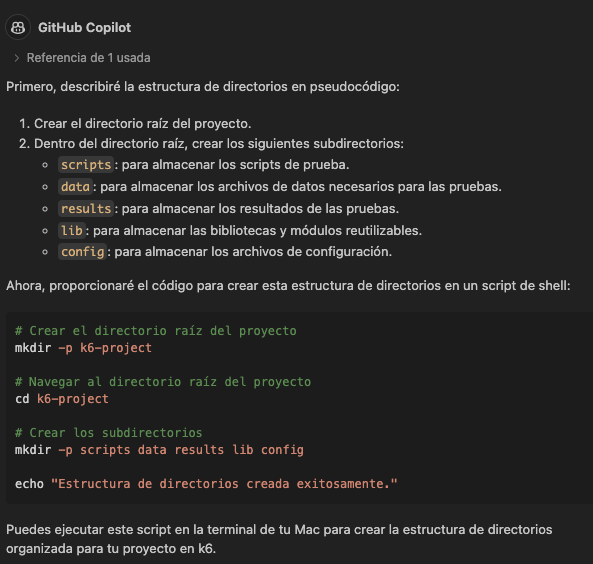
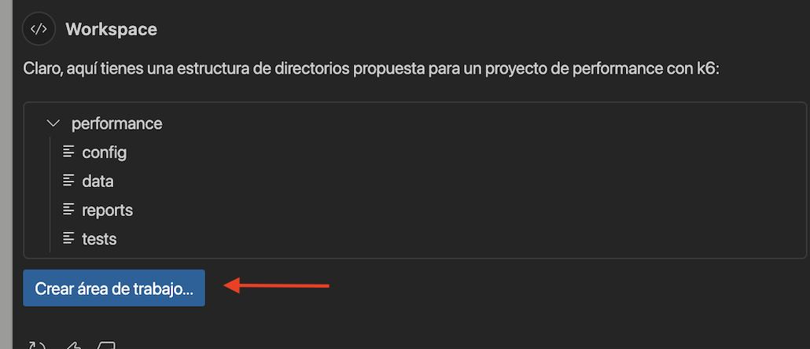
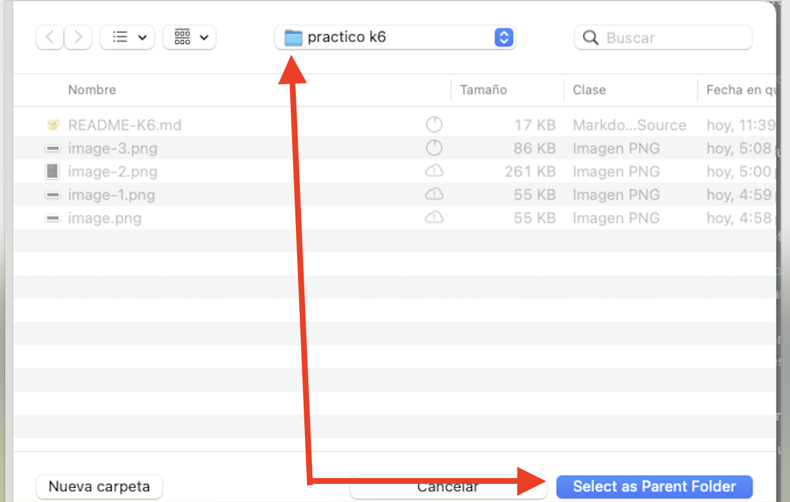
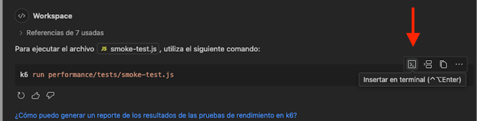

# copilot-qa-k6
This is a practical guide aimed at creating performance tests using GitHub Copilot. This way, we can create our own framework and adapt it to our needs with GitHub Copilot.

# Adoption Copilot QA

## Description
Adoption Copilot is a tool designed to facilitate and automate testing and development processes, integrating artificial intelligence through GitHub Copilot to improve efficiency and accuracy in creating performance test cases and automation scenarios. This tool is aimed at testers who want to optimize the time required to create performance test scripts for applications.

## Program Scope
1. We will create a performance testing framework in K6 from scratch.
2. We will create 4 performance tests (Smoke, Load, Stress, Spike) for K6.
3. We will generate a data file with test options to use in the different tests we have.
4. We will generate an execution command for each of the performance tests.
5. We will generate a performance test report in K6.
6. We will use GitHub Copilot commands for creating performance tests: @workspace and #file.

## Branching Policies for Solving the Adoption Copilot Program Exercises

- **Main Branch (`main`)**:
    - Always contains the most up-to-date version of `README.md`.
- **Hands-On Solved Branches (`solved`)**:
    -   git checkout solved
- **Hands-On Branches for Activities (`copilot_practico_k6`)**:
    - For this exercise, we will switch to the `copilot_practico_k6` branch.

## Prerequisites / Installation

### Prerequisites
- Install using the official installer:
    - https://dl.k6.io/msi/k6-latest-amd64.msi
    - Or via brew on macOS: `brew install k6`
- **Git** installed for version control.
- Access to the following test endpoints:
1. https://test.k6.io/
2. https://jsonplaceholder.typicode.com/posts/

### Project Setup with GitHub
1. **Clone the remote repository:**
   ```bash
      git clone https://github.com/CleveritDemo/copilot-qa-k6.git
   ```
2. **Open the IDE:**
   ```bash
   Visual Studio Code
   ```
3. **Open the cloned repository in the IDE:**
   The readme will be displayed.

4. **Open the terminal from the IDE:**
   The terminal should be opened from the IDE used.

5. **Switch the branch:**
   ```bash
   git checkout copilot_practico_k6
   ```
6. **Validate that K6 is installed:**
   ```bash
   K6 version
   ```
7. **Validate that the GitHub Copilot extension is installed:**

## Steps to Complete the Hands-On

### 1. **Initial Setup:**
Make sure you have completed all installation steps and prerequisites.

### 2. **Steps:**

***
### 2.1 **Creating the Base Project Structure:**
We will create the performance testing project to generate test cases using GitHub Copilot within our framework. In this exercise, we will ask GitHub Copilot chat to generate a performance testing framework in K6 and analyze the response provided by the AI.
***
- #### Exercise 1: **Create the project structure**
1.  **Send the following prompt:**
```bash
I need to create an organized directory structure for a k6 project
```
2. **Copilot's Response:**
`ALWAYS` review the solutions provided by the AI, as not all results are correct or useful for our needs. In this case, as we can see, the project structure created should make sense and the proposed files should be those we need to perform performance tests.



In this result, we can see how it tentatively suggests how our framework for this type of testing could be structured, but in reality, we probably already have an idea of how we want our project structure, so it will be necessary for us to define this structure beforehand to provide these details as part of the prompt we send to Copilot.

***
- #### Exercise 2: **Create the base project structure with more specifications using the `@workspace /new` command**
Objective of the exercise:
In this exercise, we will consult Copilot chat and analyze the response it returns, detailing which directories the project should have. For this exercise, we will use the GitHub Copilot commands `@workspace` and `/new`.

1. Send the following prompt:
```bash
@workspace /new I need to create an organized directory structure to generate a performance project with k6 as follows:
    1. performance: Main project folder
    2. config: Folder to store test options.
    3. data: Folder to store data files.
    4. reports: Folder to store reports.
    5. tests: Folder to store tests.
```

2. **Copilot's Response:**
After reviewing the response, proceed to create the suggested framework by clicking the `Create workspace` button.
    


3. Create the project in the same path or folder where this practical's readme is located.



Sure, here is a proposed directory structure for a k6 performance testing project:
Click on `**Create workspace**` and select the folder where the project will be created.

4. **Reflections on the exercise:**
As we can see, the result was as expected since, after reviewing the response, it returned the directories with the desired structure. It is important to note that it will depend on what we have defined for our project base and how we want to implement it, which means that the knowledge of the person performing this activity must always be present to ensure that each response meets the need.
It is important to note that for this exercise, we relied on the @workspace and /new commands, which allow us to obtain the requested framework creation in the response and generated the access button to create the framework in the folder where this practical's readme is located.

### 2.2 **Creating Test Cases (Smoke Test):**
We will use the structure created earlier to request the generation of a test case using GitHub Copilot within our framework.

In this step, we will ask it to generate a smoke test, for which we will provide all the necessary specifications that fit our needs. We will accompany this prompt with the GitHub Copilot @workspace command so it takes the context of the structure we created earlier as well as the list of specifications. It should create a smoke test case, and we will analyze the response Copilot returns.

1. Send the following prompt:

  ```bash
    @workspace Create a test named smoke-test.js in k6 for a smoke test that:
    1. Targets the following url: https://test.k6.io
    2. Configures 1 user
    3. The duration should be 60 seconds
    4. 95% of requests must complete in less than 2s
    5. Validate that the response code is 200
    6. Response time less than 250ms.
   ```

2. **Copilot's Response:**
As we can see, the response suggested the following test, which matches what we requested in the prompt, so we can proceed to copy the code and paste it into our test file.
- We can see that it refers to the URL we indicated in the prompt.
- It is configured for 1 user.
- The test duration is 60 seconds as we indicated.
- The percentage of requests must complete in less than 2s.
- It added the validation for the status code and that the response time is 250ms.

**Code**
1. Create the file smoke-test.js in the tests folder of your project. Then, add the following code:

 ```bash
import http from 'k6/http';
import { check, sleep } from 'k6';

export const options = {
    vus: 1, // 1 user
    duration: '60s', // 60 seconds duration
    thresholds: {
        http_req_duration: ['p(95)<2000'], // 95% of requests must complete in less than 2s
    },
};

export default function () {
    const res = http.get('https://test.k6.io');
    check(res, {
        'status is 200': (r) => r.status === 200, // validate response code 200
        'response time is less than 250ms': (r) => r.timings.duration < 250, // response time less than 250ms
    });
    sleep(1);
}
   ```

#### 2.3 Generate the test execution command using @workspace and #file
With this step, we will ask Copilot to generate the execution command for the file we just created in the previous step.

1. Send the following prompt:
```bash
@workspace Generate the execution command for the file #file:smoke-test.js
```

2. Copilot's Response:
```bash
k6 run performance/tests/smoke-test.js
```

As we can see in this response, the AI has generated the execution command for the file we just created in the previous step, so we can proceed to copy the command and paste it into our terminal to execute the test.
To execute the command, you can copy and paste it into the terminal or also click the terminal icon within the response, and this will automatically insert the command for execution.



### 2.4 Creating Load Test Cases
We will use the previously created structure to request the generation of a load test case using GitHub Copilot within our framework.

In this step, we will ask it to generate a load test, for which we will provide all the necessary specifications that fit our needs. We will accompany this prompt with the GitHub Copilot @workspace command so it takes the context of the structure we created earlier as well as the list of specifications. It should create a load test case, and we will analyze the response Copilot returns.

1. Send the following prompt:
```bash
@workspace Create a test named load-test.js in k6 that:
  1. Configures the following stages:
  2. 60 seconds duration with a target of 10 users.
  3. 120 seconds duration maintaining 10 users.
  4. 60 seconds duration reducing to 0 users.
  5. Makes a POST request to the URL: https://jsonplaceholder.typicode.com/posts/
  6. Sends the following body in each request:
{
    "userId": ${userId},
    "title": "${title}",
    "body": "${body}"
}
  7. The values of userId, title, and body should be dynamic for each user in this test.
  8. Includes a 1-second wait after the request.
  9. Validates that the response code is 201
  10. Response time less than 350ms.
  11. 97% of requests must complete in less than 2s
```

2. Copilot's Response:

**Code**
Here is the code for the file load-test.js in the tests folder of your project:

```javascript
import http from 'k6/http';
import { check, sleep } from 'k6';
import { randomIntBetween, randomString } from 'https://jslib.k6.io/k6-utils/1.1.0/index.js';

export const options = {
    stages: [
        { duration: '60s', target: 10 }, // 60 seconds duration with a target of 10 users
        { duration: '120s', target: 10 }, // 120 seconds duration maintaining 10 users
        { duration: '60s', target: 0 }, // 60 seconds duration reducing to 0 users
    ],
};

export default function () {
    const userId = randomIntBetween(1, 100);
    const title = randomString(10);
    const body = randomString(50);

    const payload = JSON.stringify({
        userId: userId,
        title: title,
        body: body,
    });

    const params = {
        headers: {
            'Content-Type': 'application/json',
        },
    };

    const res = http.post('https://jsonplaceholder.typicode.com/posts', payload, params);

    check(res, {
        'status is 201': (r) => r.status === 201, // validate response code 201
        'response time is less than 350ms': (r) => r.timings.duration < 350, // response time less than 350ms
    });

    sleep(1); // 1-second wait after the request
}
```

As we can see, the response suggested the following load test, which matches what we requested in the prompt, so we can proceed to copy the code and paste it into our test file.
- We can see that it refers to the URL we indicated in the prompt.
- It is configured for the number of users we indicated by duration.
- The percentage of requests must complete in less than 2s.
- It includes a wait time between requests.
- It added the validation for the status code and that the response time is 350ms.
- It generated a method to generate dynamic values for the userId, title, and body fields.
- A different body is sent in each request for each user.

3. Generate the test execution command using @workspace and #file
With this step, we will ask Copilot to generate the execution command for the file we just created in the previous step.

1. Send the following prompt:
```bash
@workspace Generate the execution command for the file #file:load-test.js
```

2. Copilot's Response:
```bash
k6 run performance/tests/load-test.js
```

As we can see in this response, the AI has generated the execution command for the file we just created in the previous step, so we can proceed to copy the command and paste it into our terminal to execute the test.
To execute the command, you can copy and paste it into the terminal or click the terminal icon within the response, and this will automatically insert the command for execution.


### 2.5 Creating Stress Test Cases
We will use the previously created structure to request the generation of a stress test case using GitHub Copilot within our framework.

In this step, we will ask it to generate a stress test, for which we will provide all the necessary specifications that fit our needs. We will accompany this prompt with the GitHub Copilot @workspace command so it takes the context of the structure we created earlier as well as the list of specifications. It should create a stress test case, and we will analyze the response Copilot returns.

1. Send the following prompt:
```bash
@workspace Create a test named stress-test.js in k6 that:
1. Configures the following stages:
    - 60 seconds duration with a target of 20 users.
    - 180 seconds duration maintaining 20 users.
    - 30 seconds duration reducing to 0 users.
2. Makes a GET request to the URL: https://test-api.k6.io
3. Includes a 1-second wait after the request.
4. Validates that the response code is 200
5. Response time less than 250ms.
```

2. Copilot's Response:

**Code**
Create the file stress-test.js in the tests folder of your project. Then, add the following code:

```javascript
import http from 'k6/http';
import { check, sleep } from 'k6';

export const options = {
    stages: [
        { duration: '60s', target: 20 }, // 60 seconds duration with a target of 20 users
        { duration: '180s', target: 20 }, // 180 seconds duration maintaining 20 users
        { duration: '30s', target: 0 }, // 30 seconds duration reducing to 0 users
    ],
};

export default function () {
    const res = http.get('https://test-api.k6.io');
    check(res, {
        'status is 200': (r) => r.status === 200, // validate response code 200
        'response time is less than 250ms': (r) => r.timings.duration < 250, // response time less than 250ms
    });
    sleep(1); // 1-second wait after the request
}
```

3. Generate the test execution command using @workspace and #file
With this step, we will ask Copilot to generate the execution command for the file we just created in the previous step.

1. Send the following prompt:
```bash
@workspace Generate the execution command for the file #file:stress-test.js
```

2. Copilot's Response:
```bash
k6 run performance/tests/stress-test.js
```

As we can see in this response, the AI has generated the execution command for the file we just created in the previous step, so we can proceed to copy the command and paste it into our terminal to execute the test.
To execute the command, you can copy and paste it into the terminal or click the terminal icon within the response, and this will automatically insert the command for execution.


### 2.6 Creating Spike Test Cases
We will use the previously created structure to request the generation of a spike test case using GitHub Copilot within our framework.

In this step, we will ask it to generate a spike test, for which we will provide all the necessary specifications that fit our needs. We will accompany this prompt with the GitHub Copilot @workspace command so it takes the context of the structure we created earlier as well as the list of specifications. It should create a spike test case, and we will analyze the response Copilot returns.

1. Send the following prompt:
```bash
@workspace Create a test named spike-test.js in k6 that:
1. Configures the following stages:
2. 60 seconds duration with a target of 20 users.
3. 30 seconds duration reducing to 0 users.
4. 60 seconds duration maintaining 20 users.
5. 30 seconds duration reducing to 0 users.
6. 60 seconds duration maintaining 20 users.
7. 30 seconds duration reducing to 0 users.
8. Makes a POST request to the URL: https://jsonplaceholder.typicode.com/posts/
9. Sends the following body in each request:
{
    "userId": ${userId},
    "title": "${title}",
    "body": "${body}"
}
10. The values of userId, title, and body should be dynamic for each user in this test.
11. Validates that the response code is 201
12. Response time less than 200ms.
```

2. Copilot's Response:

**Code**
Create the file spike-test.js in the tests folder of your project. Then, add the following code:

```javascript
import http from 'k6/http';
import { check, sleep } from 'k6';
import { randomIntBetween, randomString } from 'https://jslib.k6.io/k6-utils/1.1.0/index.js';

export const options = {
    stages: [
        { duration: '60s', target: 20 }, // 60 seconds duration with a target of 20 users
        { duration: '30s', target: 0 }, // 30 seconds duration reducing to 0 users
        { duration: '60s', target: 20 }, // 60 seconds duration maintaining 20 users
        { duration: '30s', target: 0 }, // 30 seconds duration reducing to 0 users
        { duration: '60s', target: 20 }, // 60 seconds duration maintaining 20 users
        { duration: '30s', target: 0 }, // 30 seconds duration reducing to 0 users
    ],
};

export default function () {
    const userId = randomIntBetween(1, 100);
    const title = randomString(10);
    const body = randomString(50);

    const payload = JSON.stringify({
        userId: userId,
        title: title,
        body: body,
    });

    const params = {
        headers: {
            'Content-Type': 'application/json',
        },
    };

    const res = http.post('https://jsonplaceholder.typicode.com/posts', payload, params);

    check(res, {
        'status is 201': (r) => r.status === 201, // validate response code 201
        'response time is less than 200ms': (r) => r.timings.duration < 200, // response time less than 200ms
    });

    sleep(1); // 1-second wait after the request
}
```

3. Generate the test execution command using @workspace and #file
With this step, we will ask Copilot to generate the execution command for the file we just created in the previous step.

1. Send the following prompt:
```bash
@workspace Generate the execution command for the file #file:spike-test.js
```

2. Copilot's Response:
```bash
k6 run performance/tests/spike-test.js
```

As we can see in this response, the AI has generated the execution command for the file we just created in the previous step, so we can proceed to copy the command and paste it into our terminal to execute the test.
To execute the command, you can copy and paste it into the terminal or click the terminal icon within the response, and this will automatically insert the command for execution.


### 2.7 Creating a Configuration File for Performance Tests
We will use the created tests to create a configuration file that groups in different constants the values of the different duration targets for each test.
We will also ask Copilot to make the necessary modifications within the tests so that they can obtain this information from the configuration file.

1. Send the following prompt:
```bash
@workspace create a configuration file named config-test-options.js:
1. Inside the config directory where you can define different test configurations to use in the different tests we have #file:smoke-test.js #file:load-test.js #file:stress-test.js #file:spike-test.js for:
2. Create a function named getTestOptions and have a variable to send the test type with the duration configurations by test type.
3. Make the modification in each test for this constant.
```

2. Copilot's Response:

Here is the code for the file `config-test-options.js` in the `config` folder of your project:

```javascript
// performance/config/config-test-options.js

export const smokeTestOptions = {
    vus: 1, // 1 user
    duration: '60s', // 60 seconds duration
    thresholds: {
        http_req_duration: ['p(95)<2000'], // 95% of requests must complete in less than 2s
    },
};

export const loadTestOptions = {
    stages: [
        { duration: '60s', target: 10 }, // 60 seconds duration with a target of 10 users
        { duration: '120s', target: 10 }, // 120 seconds duration maintaining 10 users
        { duration: '60s', target: 0 }, // 60 seconds duration reducing to 0 users
    ],
};

export const stressTestOptions = {
    stages: [
        { duration: '60s', target: 20 }, // 60 seconds duration with a target of 20 users
        { duration: '180s', target: 20 }, // 180 seconds duration maintaining 20 users
        { duration: '30s', target: 0 }, // 30 seconds duration reducing to 0 users
    ],
};

export const spikeTestOptions = {
    stages: [
        { duration: '60s', target: 20 }, // 60 seconds duration with a target of 20 users
        { duration: '30s', target: 0 }, // 30 seconds duration reducing to 0 users
        { duration: '60s', target: 20 }, // 60 seconds duration maintaining 20 users
        { duration: '30s', target: 0 }, // 30 seconds duration reducing to 0 users
        { duration: '60s', target: 20 }, // 60 seconds duration maintaining 20 users
        { duration: '30s', target: 0 }, // 30 seconds duration reducing to 0 users
    ],
};

export function getTestOptions(testType) {
    switch (testType) {
        case 'smoke':
            return smokeTestOptions;
        case 'load':
            return loadTestOptions;
        case 'stress':
            return stressTestOptions;
        case 'spike':
            return spikeTestOptions;
        default:
            throw new Error(`Unknown test type: ${testType}`);
    }
}
```

Now, make the modification in each test to use this configuration:

- **smoke-test.js**
```javascript
import http from 'k6/http';
import { check, sleep } from 'k6';
import { getTestOptions } from '../config/config-test-options.js';

export const options = getTestOptions('smoke');

export default function () {
    const res = http.get('https://test.k6.io');
    check(res, {
        'status is 200': (r) => r.status === 200, // validate response code 200
        'response time is less than 250ms': (r) => r.timings.duration < 250, // response time less than 250ms
    });
    sleep(1);
}
```

- **load-test.js**
```javascript
import http from 'k6/http';
import { check, sleep } from 'k6';
import { randomIntBetween, randomString } from 'https://jslib.k6.io/k6-utils/1.1.0/index.js';
import { getTestOptions } from '../config/config-test-options.js';

export const options = getTestOptions('load');

export default function () {
    const userId = randomIntBetween(1, 100);
    const title = randomString(10);
    const body = randomString(50);

    const payload = JSON.stringify({
        userId: userId,
        title: title,
        body: body,
    });

    const params = {
        headers: {
            'Content-Type': 'application/json',
        },
    };

    const res = http.post('https://jsonplaceholder.typicode.com/posts', payload, params);

    check(res, {
        'status is 201': (r) => r.status === 201, // validate response code 201
        'response time is less than 350ms': (r) => r.timings.duration < 350, // response time less than 350ms
    });

    sleep(1); // 1-second wait after the request
}
```

- **stress-test.js**
```javascript
import http from 'k6/http';
import { check, sleep } from 'k6';
import { getTestOptions } from '../config/config-test-options.js';

export const options = getTestOptions('stress');

export default function () {
    const res = http.get('https://test-api.k6.io');
    check(res, {
        'status is 200': (r) => r.status === 200, // validate response code 200
        'response time is less than 250ms': (r) => r.timings.duration < 250, // response time less than 250ms
    });
    sleep(1); // 1-second wait after the request
}
```

- **spike-test.js**
```javascript
import http from 'k6/http';
import { check, sleep } from 'k6';
import { randomIntBetween, randomString } from 'https://jslib.k6.io/k6-utils/1.1.0/index.js';
import { getTestOptions } from '../config/config-test-options.js';

export const options = getTestOptions('spike');

export default function () {
    const userId = randomIntBetween(1, 100);
    const title = randomString(10);
    const body = randomString(50);

    const payload = JSON.stringify({
        userId: userId,
        title: title,
        body: body,
    });

    const params = {
        headers: {
            'Content-Type': 'application/json',
        },
    };

    const res = http.post('https://jsonplaceholder.typicode.com/posts', payload, params);

    check(res, {
        'status is 201': (r) => r.status === 201, // validate response code 201
        'response time is less than 200ms': (r) => r.timings.duration < 200, // response time less than 200ms
    });

    sleep(1); // 1-second wait after the request
}
```

### 2.8 Creating a Data File for Performance Tests
We will ask the AI to help us create a data file inside the corresponding directory to concentrate in one place the data we need to perform the tests, such as the request bodies we are going to use or the URLs used in the tests.

1. Send the following prompt:
```bash
@workspace create a data file named data-test.js:
1. Inside the data directory where you can have a constant with the request body configuration for the tests #file:smoke-test.js #file:load-test.js #file:stress-test.js #file:spike-test.js for:
2. Create a function named getTestData and have a variable to send the test the request data
3. Create a constant to group the different URLs used in the tests
3. Make the modification in each test for these constants.
```

2. Copilot's Response:

Here is the code for the file `data-test.js` in the `data` folder of your project:

```javascript
// performance/data/data-test.js

import { randomIntBetween, randomString } from 'https://jslib.k6.io/k6-utils/1.1.0/index.js';

export const urls = {
    smokeTestUrl: 'https://test.k6.io',
    loadTestUrl: 'https://jsonplaceholder.typicode.com/posts',
    stressTestUrl: 'https://test-api.k6.io',
    spikeTestUrl: 'https://jsonplaceholder.typicode.com/posts',
};

export function getTestData() {
    const userId = randomIntBetween(1, 100);
    const title = randomString(10);
    const body = randomString(50);

    return JSON.stringify({
        userId: userId,
        title: title,
        body: body,
    });
}
```

Now, make the modification in each test to use this configuration:

- **smoke-test.js**
```javascript
import http from 'k6/http';
import { check, sleep } from 'k6';
import { getTestOptions } from '../config/config-test-options.js';
import { urls } from '../data/data-test.js';

export const options = getTestOptions('smoke');

export default function () {
    const res = http.get(urls.smokeTestUrl);
    check(res, {
        'status is 200': (r) => r.status === 200, // validate response code 200
        'response time is less than 250ms': (r) => r.timings.duration < 250, // response time less than 250ms
    });
    sleep(1);
}
```

- **load-test.js**
```javascript
import http from 'k6/http';
import { check, sleep } from 'k6';
import { randomIntBetween, randomString } from 'https://jslib.k6.io/k6-utils/1.1.0/index.js';
import { getTestOptions } from '../config/config-test-options.js';
import { urls, getTestData } from '../data/data-test.js';

export const options = getTestOptions('load');

export default function () {
    const payload = getTestData();
    const params = {
        headers: {
            'Content-Type': 'application/json',
        },
    };

    const res = http.post(urls.loadTestUrl, payload, params);

    check(res, {
        'status is 201': (r) => r.status === 201, // validate response code 201
        'response time is less than 350ms': (r) => r.timings.duration < 350, // response time less than 350ms
    });

    sleep(1); // 1-second wait after the request
}
```

- **stress-test.js**
```javascript
import http from 'k6/http';
import { check, sleep } from 'k6';
import { getTestOptions } from '../config/config-test-options.js';
import { urls } from '../data/data-test.js';

export const options = getTestOptions('stress');

export default function () {
    const res = http.get(urls.stressTestUrl);
    check(res, {
        'status is 200': (r) => r.status === 200, // validate response code 200
        'response time is less than 250ms': (r) => r.timings.duration < 250, // response time less than 250ms
    });
    sleep(1); // 1-second wait after the request
}
```

- **spike-test.js**
```javascript
import http from 'k6/http';
import { check, sleep } from 'k6';
import { randomIntBetween, randomString } from 'https://jslib.k6.io/k6-utils/1.1.0/index.js';
import { getTestOptions } from '../config/config-test-options.js';
import { urls, getTestData } from '../data/data-test.js';

export const options = getTestOptions('spike');

export default function () {
    const payload = getTestData();
    const params = {
        headers: {
            'Content-Type': 'application/json',
        },
    };

    const res = http.post(urls.spikeTestUrl, payload, params);

    check(res, {
        'status is 201': (r) => r.status === 201, // validate response code 201
        'response time is less than 200ms': (r) => r.timings.duration < 200, // response time less than 200ms
    });

    sleep(1); // 1-second wait after the request
}
```

### 2.9 Configuring Reports for Performance Tests
We will use the created tests to configure the reports using GitHub Copilot within our framework.

In this step, we will ask Copilot to help us add the report configuration.

```bash
@workspace configure the htmlReport and textSummary report:
1. In the different tests #file:smoke-test.js #file:load-test.js #file:stress-test.js #file:spike-test.js
2. The report output should be shown in the reports directory
3. The report name should include the execution date
```

- **Copilot's Response:**

Here is the configuration for the `htmlReport` and `textSummary` reports in the different tests so that the report output is shown in the `reports` directory:
Now, make the modification in each test to use this configuration:

- **smoke-test.js**
```javascript
import http from 'k6/http';
import { check, sleep } from 'k6';
import { getTestOptions } from '../config/config-test-options.js';
import { urls } from '../data/data-test.js';

export const options = {
    ...getTestOptions('smoke'),
    summaryTrendStats: ['avg', 'min', 'max', 'p(95)'],
    thresholds: {
        http_req_duration: ['p(95)<2000'],
    },
};

export default function () {
    const res = http.get(urls.smokeTestUrl);
    check(res, {
        'status is 200': (r) => r.status === 200, // validate response code 200
        'response time is less than 250ms': (r) => r.timings.duration < 250, // response time less than 250ms
    });
    sleep(1);
}
```

- **load-test.js**
```javascript
import http from 'k6/http';
import { check, sleep } from 'k6';
import { randomIntBetween, randomString } from 'https://jslib.k6.io/k6-utils/1.1.0/index.js';
import { getTestOptions } from '../config/config-test-options.js';
import { urls, getTestData } from '../data/data-test.js';

export const options = {
    ...getTestOptions('load'),
    summaryTrendStats: ['avg', 'min', 'max', 'p(95)'],
    thresholds: {
        http_req_duration: ['p(95)<350'],
    },
};

export default function () {
    const payload = getTestData();
    const params = {
        headers: {
            'Content-Type': 'application/json',
        },
    };

    const res = http.post(urls.loadTestUrl, payload, params);

    check(res, {
        'status is 201': (r) => r.status === 201, // validate response code 201
        'response time is less than 350ms': (r) => r.timings.duration < 350, // response time less than 350ms
    });

    sleep(1); // 1-second wait after the request
}
```

- **stress-test.js**
```javascript
import http from 'k6/http';
import { check, sleep } from 'k6';
import { getTestOptions } from '../config/config-test-options.js';
import { urls } from '../data/data-test.js';

export const options = {
    ...getTestOptions('stress'),
    summaryTrendStats: ['avg', 'min', 'max', 'p(95)'],
    thresholds: {
        http_req_duration: ['p(95)<250'],
    },
};

export default function () {
    const res = http.get(urls.stressTestUrl);
    check(res, {
        'status is 200': (r) => r.status === 200, // validate response code 200
        'response time is less than 250ms': (r) => r.timings.duration < 250, // response time less than 250ms
    });
    sleep(1); // 1-second wait after the request
}
```

- **spike-test.js**
```javascript
import http from 'k6/http';
import { check, sleep } from 'k6';
import { randomIntBetween, randomString } from 'https://jslib.k6.io/k6-utils/1.1.0/index.js';
import { getTestOptions } from '../config/config-test-options.js';
import { urls, getTestData } from '../data/data-test.js';

export const options = {
    ...getTestOptions('spike'),
    summaryTrendStats: ['avg', 'min', 'max', 'p(95)'],
    thresholds: {
        http_req_duration: ['p(95)<200'],
    },
};

export default function () {
    const payload = getTestData();
    const params = {
        headers: {
            'Content-Type': 'application/json',
        },
    };

    const res = http.post(urls.spikeTestUrl, payload, params);

    check(res, {
        'status is 201': (r) => r.status === 201, // validate response code 201
        'response time is less than 200ms': (r) => r.timings.duration < 200, // response time less than 200ms
    });

    sleep(1); // 1-second wait after the request
}
```

## Reflections on the Exercise

As we can see, Copilot has suggested the configuration we need for the performance test reports, as well as the modifications we must make in each test so that they can obtain this information from the configuration file.

This way, we can continue adding the necessary scalability to our work environment for proper maintenance.

***
