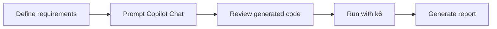

<div align="center">

  # 🚀 Copilot QA — k6 Performance Testing Framework

  [](https://github.com/features/copilot)
  [](https://k6.io/)
  [](https://developer.mozilla.org/docs/Web/JavaScript)
  [](https://code.visualstudio.com/)

  **🌐 Language:** **English** · [Español](./README.md)

</div>

---

**This hands-on training** teaches you how to **build a performance testing framework in k6 from scratch** using **GitHub Copilot**. You will create four canonical performance test types (**Smoke, Load, Stress, Spike**), centralize test options and request data in reusable files, and generate **HTML and text reports** — all driven by Copilot Chat prompts.

> For more information about the tools used in this workshop, check the official documentation:
>
> - [GitHub Copilot Chat](https://docs.github.com/en/copilot/how-tos/use-copilot-chat)
> - [Grafana k6 Documentation](https://grafana.com/docs/k6/latest/)
> - [k6 Test Types (Smoke, Load, Stress, Spike)](https://grafana.com/docs/k6/latest/testing-guides/test-types/)
> - [k6 Options & Thresholds](https://grafana.com/docs/k6/latest/using-k6/thresholds/)
> - [k6 HTML Reporter](https://github.com/benc-uk/k6-reporter)

---

## 📋 Table of Contents

1. [🎯 Learning objectives](#-learning-objectives)
2. [⏱️ Estimated duration](#️-estimated-duration)
3. [📚 Prerequisites](#-prerequisites)
4. [🌿 Branching policy](#-branching-policy)
5. [🧩 GitHub Copilot variables used](#-github-copilot-variables-used)
6. [🗂️ Step 1. Scaffold the base project structure](#️-step-1-scaffold-the-base-project-structure)
7. [💨 Step 2. Smoke test](#-step-2-smoke-test)
8. [📈 Step 3. Load test](#-step-3-load-test)
9. [🔥 Step 4. Stress test](#-step-4-stress-test)
10. [⚡ Step 5. Spike test](#-step-5-spike-test)
11. [⚙️ Step 6. Central configuration file](#️-step-6-central-configuration-file)
12. [🗃️ Step 7. Test data file](#️-step-7-test-data-file)
13. [📊 Step 8. Configure reports](#-step-8-configure-reports)
14. [🧭 Final reflections](#-final-reflections)

---

## 🎯 Learning objectives

By the end of this workshop you will be able to:

- ✅ Scaffold an organized **k6 project structure** with GitHub Copilot using the `#new` variable.
- ✅ Create four performance test types — **Smoke, Load, Stress, Spike** — from natural-language prompts.
- ✅ Generate the **execution command** for each test using `#codebase` and `#file`.
- ✅ Centralize test options in a **configuration file** (`config-test-options.js`).
- ✅ Centralize request bodies and URLs in a **data file** (`data-test.js`).
- ✅ Produce **HTML and text reports** with the execution date in the `reports/` directory.

> [!TIP]
> `ALWAYS` review the code Copilot suggests. Not every result is correct or fits your needs — your domain knowledge is what turns a good suggestion into a great test.

---

## ⏱️ Estimated duration

| Block                                          | Time        |
| ---------------------------------------------- | ----------- |
| 📚 Setup and prerequisites                     | 10 min      |
| 🗂️ Step 1 - Scaffold the project structure     | 5 min       |
| 💨 Step 2 - Smoke test                          | 10 min      |
| 📈 Step 3 - Load test                           | 10 min      |
| 🔥 Step 4 - Stress test                         | 10 min      |
| ⚡ Step 5 - Spike test                          | 10 min      |
| ⚙️ Step 6 - Configuration file                  | 10 min      |
| 🗃️ Step 7 - Data file                           | 10 min      |
| 📊 Step 8 - Reports                             | 10 min      |
| **Total**                                      | **~85 min** |

---

## 📚 Prerequisites

Before you start, make sure you have:

- [Grafana k6](https://grafana.com/docs/k6/latest/set-up/install-k6/) installed:
  - Windows (official installer): <https://dl.k6.io/msi/k6-latest-amd64.msi>
  - macOS (Homebrew): `brew install k6`
- [Git](https://git-scm.com/downloads) installed for version control.
- [Visual Studio Code](https://code.visualstudio.com/).
- [GitHub Copilot](https://github.com/features/copilot) active in VS Code (extension + subscription).
- Access to the following test endpoints:
  - <https://test.k6.io/>
  - <https://jsonplaceholder.typicode.com/posts/>

Verify your installation:

```bash
k6 version
git --version
code --version
```

### Project setup with GitHub

```bash
# 1. Clone the remote repository
git clone https://github.com/CleveritDemo/copilot-qa-k6.git

# 2. Open the folder in Visual Studio Code, then open the integrated terminal

# 3. Switch to the practice branch
git checkout copilot_practico_k6
```

---

## 🌿 Branching policy

| Branch                    | Purpose                                                        |
| ------------------------- | ------------------------------------------------------------- |
| `main`                    | Always holds the most up-to-date version of the `README`.     |
| `solved`                  | Hands-on already solved — `git checkout solved`.              |
| `copilot_practico_k6`     | Working branch to complete the activities.                    |

---

## 🧩 GitHub Copilot variables used

This workshop relies on modern GitHub Copilot **chat variables** instead of the legacy `@workspace` participant:

| Variable     | What it does                                                                                  |
| ------------ | --------------------------------------------------------------------------------------------- |
| `#new`       | Scaffolds a **new project/workspace** structure from your description.                         |
| `#codebase`  | Gives Copilot the **whole workspace as context** to create or modify files.                   |
| `#file`      | References a **specific file** (e.g. `#file:smoke-test.js`) so Copilot works against it.       |

The typical cycle for every test looks like this:



---

## 🗂️ Step 1. Scaffold the base project structure

**Goal:** create an organized directory structure to run performance tests, using GitHub Copilot to generate the framework and analyzing its response.

### 1.1 First attempt — a generic prompt

Open Copilot Chat and send a plain, unspecified prompt:

```text
I need to create an organized directory structure for a k6 project
```

> [!NOTE]
> The response is a *tentative* proposal. It usually makes sense, but it rarely matches the exact layout you have in mind. That's why the next step defines the structure explicitly.

### 1.2 Scaffold with the `#new` variable

Use the **`#new`** variable so Copilot scaffolds the project and offers a **Create workspace** button. Send the following prompt:

```text
#new I need to create an organized directory structure to generate a performance project with k6 as follows:
    1. performance: Main project folder
    2. config: Folder to store test options.
    3. data: Folder to store data files.
    4. reports: Folder to store reports.
    5. tests: Folder to store tests.
```

After reviewing the response, click **Create workspace** and select the folder where this README lives. The resulting structure is:

```text
performance/
├── config/     # Test options
├── data/       # Data files
├── reports/    # Generated reports
└── tests/      # Test scenarios
```

> [!TIP]
> The result depends on what you have defined for your project base and how you want to implement it. The `#new` variable returns the requested framework and generates the button to create it in the current folder.

---

## 💨 Step 2. Smoke test

**Goal:** generate a smoke test with `#codebase` so Copilot uses the structure created earlier as context, then analyze the response.

### 2.1 Prompt

```text
#codebase Create a test named smoke-test.js in k6 for a smoke test that:
1. Targets the following url: https://test.k6.io
2. Configures 1 user
3. The duration should be 60 seconds
4. 95% of requests must complete in less than 2s
5. Validate that the response code is 200
6. Response time less than 250ms.
```

### 2.2 Result

Create the file `smoke-test.js` in the `tests` folder and add the following code:

```javascript
import http from 'k6/http';
import { check, sleep } from 'k6';

export const options = {
    vus: 1, // 1 user
    duration: '60s', // 60 seconds duration
    thresholds: {
        http_req_duration: ['p(95)<2000'], // 95% of requests must complete in less than 2s
    },
};

export default function () {
    const res = http.get('https://test.k6.io');
    check(res, {
        'status is 200': (r) => r.status === 200, // validate response code 200
        'response time is less than 250ms': (r) => r.timings.duration < 250, // response time less than 250ms
    });
    sleep(1);
}
```

### 2.3 Generate the execution command

```text
#codebase Generate the execution command for the file #file:smoke-test.js
```

**Copilot's response:**

```bash
k6 run performance/tests/smoke-test.js
```

> [!TIP]
> You can copy the command into the terminal, or click the terminal icon in the response to insert it automatically.

---

## 📈 Step 3. Load test

**Goal:** generate a load test with staged ramp-up/steady/ramp-down and a dynamic POST body.

### 3.1 Prompt

```text
#codebase Create a test named load-test.js in k6 that:
1. Configures the following stages:
2. 60 seconds duration with a target of 10 users.
3. 120 seconds duration maintaining 10 users.
4. 60 seconds duration reducing to 0 users.
5. Makes a POST request to the URL: https://jsonplaceholder.typicode.com/posts/
6. Sends the following body in each request:
{
    "userId": ${userId},
    "title": "${title}",
    "body": "${body}"
}
7. The values of userId, title, and body should be dynamic for each user in this test.
8. Includes a 1-second wait after the request.
9. Validates that the response code is 201
10. Response time less than 350ms.
11. 97% of requests must complete in less than 2s
```

### 3.2 Result

```javascript
import http from 'k6/http';
import { check, sleep } from 'k6';
import { randomIntBetween, randomString } from 'https://jslib.k6.io/k6-utils/1.1.0/index.js';

export const options = {
    stages: [
        { duration: '60s', target: 10 }, // 60 seconds duration with a target of 10 users
        { duration: '120s', target: 10 }, // 120 seconds duration maintaining 10 users
        { duration: '60s', target: 0 }, // 60 seconds duration reducing to 0 users
    ],
};

export default function () {
    const userId = randomIntBetween(1, 100);
    const title = randomString(10);
    const body = randomString(50);

    const payload = JSON.stringify({
        userId: userId,
        title: title,
        body: body,
    });

    const params = {
        headers: {
            'Content-Type': 'application/json',
        },
    };

    const res = http.post('https://jsonplaceholder.typicode.com/posts', payload, params);

    check(res, {
        'status is 201': (r) => r.status === 201, // validate response code 201
        'response time is less than 350ms': (r) => r.timings.duration < 350, // response time less than 350ms
    });

    sleep(1); // 1-second wait after the request
}
```

### 3.3 Generate the execution command

```text
#codebase Generate the execution command for the file #file:load-test.js
```

**Copilot's response:**

```bash
k6 run performance/tests/load-test.js
```

---

## 🔥 Step 4. Stress test

**Goal:** push the system beyond normal load with a sustained 20-user stage.

### 4.1 Prompt

```text
#codebase Create a test named stress-test.js in k6 that:
1. Configures the following stages:
    - 60 seconds duration with a target of 20 users.
    - 180 seconds duration maintaining 20 users.
    - 30 seconds duration reducing to 0 users.
2. Makes a GET request to the URL: https://test-api.k6.io
3. Includes a 1-second wait after the request.
4. Validates that the response code is 200
5. Response time less than 250ms.
```

### 4.2 Result

```javascript
import http from 'k6/http';
import { check, sleep } from 'k6';

export const options = {
    stages: [
        { duration: '60s', target: 20 }, // 60 seconds duration with a target of 20 users
        { duration: '180s', target: 20 }, // 180 seconds duration maintaining 20 users
        { duration: '30s', target: 0 }, // 30 seconds duration reducing to 0 users
    ],
};

export default function () {
    const res = http.get('https://test-api.k6.io');
    check(res, {
        'status is 200': (r) => r.status === 200, // validate response code 200
        'response time is less than 250ms': (r) => r.timings.duration < 250, // response time less than 250ms
    });
    sleep(1); // 1-second wait after the request
}
```

### 4.3 Generate the execution command

```text
#codebase Generate the execution command for the file #file:stress-test.js
```

**Copilot's response:**

```bash
k6 run performance/tests/stress-test.js
```

---

## ⚡ Step 5. Spike test

**Goal:** simulate sudden traffic bursts with repeated ramp-up/ramp-down cycles.

### 5.1 Prompt

```text
#codebase Create a test named spike-test.js in k6 that:
1. Configures the following stages:
2. 60 seconds duration with a target of 20 users.
3. 30 seconds duration reducing to 0 users.
4. 60 seconds duration maintaining 20 users.
5. 30 seconds duration reducing to 0 users.
6. 60 seconds duration maintaining 20 users.
7. 30 seconds duration reducing to 0 users.
8. Makes a POST request to the URL: https://jsonplaceholder.typicode.com/posts/
9. Sends the following body in each request:
{
    "userId": ${userId},
    "title": "${title}",
    "body": "${body}"
}
10. The values of userId, title, and body should be dynamic for each user in this test.
11. Validates that the response code is 201
12. Response time less than 200ms.
```

### 5.2 Result

```javascript
import http from 'k6/http';
import { check, sleep } from 'k6';
import { randomIntBetween, randomString } from 'https://jslib.k6.io/k6-utils/1.1.0/index.js';

export const options = {
    stages: [
        { duration: '60s', target: 20 }, // 60 seconds duration with a target of 20 users
        { duration: '30s', target: 0 }, // 30 seconds duration reducing to 0 users
        { duration: '60s', target: 20 }, // 60 seconds duration maintaining 20 users
        { duration: '30s', target: 0 }, // 30 seconds duration reducing to 0 users
        { duration: '60s', target: 20 }, // 60 seconds duration maintaining 20 users
        { duration: '30s', target: 0 }, // 30 seconds duration reducing to 0 users
    ],
};

export default function () {
    const userId = randomIntBetween(1, 100);
    const title = randomString(10);
    const body = randomString(50);

    const payload = JSON.stringify({
        userId: userId,
        title: title,
        body: body,
    });

    const params = {
        headers: {
            'Content-Type': 'application/json',
        },
    };

    const res = http.post('https://jsonplaceholder.typicode.com/posts', payload, params);

    check(res, {
        'status is 201': (r) => r.status === 201, // validate response code 201
        'response time is less than 200ms': (r) => r.timings.duration < 200, // response time less than 200ms
    });

    sleep(1); // 1-second wait after the request
}
```

### 5.3 Generate the execution command

```text
#codebase Generate the execution command for the file #file:spike-test.js
```

**Copilot's response:**

```bash
k6 run performance/tests/spike-test.js
```

---

## ⚙️ Step 6. Central configuration file

**Goal:** group the duration/target options of every test into a single configuration file, and refactor each test to consume it.

### 6.1 Prompt

```text
#codebase create a configuration file named config-test-options.js:
1. Inside the config directory where you can define different test configurations to use in the different tests we have #file:smoke-test.js #file:load-test.js #file:stress-test.js #file:spike-test.js for:
2. Create a function named getTestOptions and have a variable to send the test type with the duration configurations by test type.
3. Make the modification in each test for this constant.
```

### 6.2 Result — `config-test-options.js`

```javascript
// performance/config/config-test-options.js

export const smokeTestOptions = {
    vus: 1, // 1 user
    duration: '60s', // 60 seconds duration
    thresholds: {
        http_req_duration: ['p(95)<2000'], // 95% of requests must complete in less than 2s
    },
};

export const loadTestOptions = {
    stages: [
        { duration: '60s', target: 10 }, // 60 seconds duration with a target of 10 users
        { duration: '120s', target: 10 }, // 120 seconds duration maintaining 10 users
        { duration: '60s', target: 0 }, // 60 seconds duration reducing to 0 users
    ],
};

export const stressTestOptions = {
    stages: [
        { duration: '60s', target: 20 }, // 60 seconds duration with a target of 20 users
        { duration: '180s', target: 20 }, // 180 seconds duration maintaining 20 users
        { duration: '30s', target: 0 }, // 30 seconds duration reducing to 0 users
    ],
};

export const spikeTestOptions = {
    stages: [
        { duration: '60s', target: 20 }, // 60 seconds duration with a target of 20 users
        { duration: '30s', target: 0 }, // 30 seconds duration reducing to 0 users
        { duration: '60s', target: 20 }, // 60 seconds duration maintaining 20 users
        { duration: '30s', target: 0 }, // 30 seconds duration reducing to 0 users
        { duration: '60s', target: 20 }, // 60 seconds duration maintaining 20 users
        { duration: '30s', target: 0 }, // 30 seconds duration reducing to 0 users
    ],
};

export function getTestOptions(testType) {
    switch (testType) {
        case 'smoke':
            return smokeTestOptions;
        case 'load':
            return loadTestOptions;
        case 'stress':
            return stressTestOptions;
        case 'spike':
            return spikeTestOptions;
        default:
            throw new Error(`Unknown test type: ${testType}`);
    }
}
```

### 6.3 Refactor each test to use the configuration

**smoke-test.js**

```javascript
import http from 'k6/http';
import { check, sleep } from 'k6';
import { getTestOptions } from '../config/config-test-options.js';

export const options = getTestOptions('smoke');

export default function () {
    const res = http.get('https://test.k6.io');
    check(res, {
        'status is 200': (r) => r.status === 200,
        'response time is less than 250ms': (r) => r.timings.duration < 250,
    });
    sleep(1);
}
```

**load-test.js**

```javascript
import http from 'k6/http';
import { check, sleep } from 'k6';
import { randomIntBetween, randomString } from 'https://jslib.k6.io/k6-utils/1.1.0/index.js';
import { getTestOptions } from '../config/config-test-options.js';

export const options = getTestOptions('load');

export default function () {
    const userId = randomIntBetween(1, 100);
    const title = randomString(10);
    const body = randomString(50);

    const payload = JSON.stringify({ userId, title, body });
    const params = { headers: { 'Content-Type': 'application/json' } };

    const res = http.post('https://jsonplaceholder.typicode.com/posts', payload, params);

    check(res, {
        'status is 201': (r) => r.status === 201,
        'response time is less than 350ms': (r) => r.timings.duration < 350,
    });

    sleep(1);
}
```

**stress-test.js**

```javascript
import http from 'k6/http';
import { check, sleep } from 'k6';
import { getTestOptions } from '../config/config-test-options.js';

export const options = getTestOptions('stress');

export default function () {
    const res = http.get('https://test-api.k6.io');
    check(res, {
        'status is 200': (r) => r.status === 200,
        'response time is less than 250ms': (r) => r.timings.duration < 250,
    });
    sleep(1);
}
```

**spike-test.js**

```javascript
import http from 'k6/http';
import { check, sleep } from 'k6';
import { randomIntBetween, randomString } from 'https://jslib.k6.io/k6-utils/1.1.0/index.js';
import { getTestOptions } from '../config/config-test-options.js';

export const options = getTestOptions('spike');

export default function () {
    const userId = randomIntBetween(1, 100);
    const title = randomString(10);
    const body = randomString(50);

    const payload = JSON.stringify({ userId, title, body });
    const params = { headers: { 'Content-Type': 'application/json' } };

    const res = http.post('https://jsonplaceholder.typicode.com/posts', payload, params);

    check(res, {
        'status is 201': (r) => r.status === 201,
        'response time is less than 200ms': (r) => r.timings.duration < 200,
    });

    sleep(1);
}
```

> [!NOTE]
> Copilot suggested the full configuration plus the modification needed in each test to read from the config file — adding scalability and easier maintenance to your framework.

---

## 🗃️ Step 7. Test data file

**Goal:** centralize the request bodies and the URLs used across the tests in a single data file.

### 7.1 Prompt

```text
#codebase create a data file named data-test.js:
1. Inside the data directory where you can have a constant with the request body configuration for the tests #file:smoke-test.js #file:load-test.js #file:stress-test.js #file:spike-test.js for:
2. Create a function named getTestData and have a variable to send the test the request data
3. Create a constant to group the different URLs used in the tests
4. Make the modification in each test for these constants.
```

### 7.2 Result — `data-test.js`

```javascript
// performance/data/data-test.js

import { randomIntBetween, randomString } from 'https://jslib.k6.io/k6-utils/1.1.0/index.js';

export const urls = {
    smokeTestUrl: 'https://test.k6.io',
    loadTestUrl: 'https://jsonplaceholder.typicode.com/posts',
    stressTestUrl: 'https://test-api.k6.io',
    spikeTestUrl: 'https://jsonplaceholder.typicode.com/posts',
};

export function getTestData() {
    const userId = randomIntBetween(1, 100);
    const title = randomString(10);
    const body = randomString(50);

    return JSON.stringify({
        userId: userId,
        title: title,
        body: body,
    });
}
```

### 7.3 Refactor each test to use the data file

**smoke-test.js**

```javascript
import http from 'k6/http';
import { check, sleep } from 'k6';
import { getTestOptions } from '../config/config-test-options.js';
import { urls } from '../data/data-test.js';

export const options = getTestOptions('smoke');

export default function () {
    const res = http.get(urls.smokeTestUrl);
    check(res, {
        'status is 200': (r) => r.status === 200,
        'response time is less than 250ms': (r) => r.timings.duration < 250,
    });
    sleep(1);
}
```

**load-test.js**

```javascript
import http from 'k6/http';
import { check, sleep } from 'k6';
import { getTestOptions } from '../config/config-test-options.js';
import { urls, getTestData } from '../data/data-test.js';

export const options = getTestOptions('load');

export default function () {
    const payload = getTestData();
    const params = { headers: { 'Content-Type': 'application/json' } };

    const res = http.post(urls.loadTestUrl, payload, params);

    check(res, {
        'status is 201': (r) => r.status === 201,
        'response time is less than 350ms': (r) => r.timings.duration < 350,
    });

    sleep(1);
}
```

**stress-test.js**

```javascript
import http from 'k6/http';
import { check, sleep } from 'k6';
import { getTestOptions } from '../config/config-test-options.js';
import { urls } from '../data/data-test.js';

export const options = getTestOptions('stress');

export default function () {
    const res = http.get(urls.stressTestUrl);
    check(res, {
        'status is 200': (r) => r.status === 200,
        'response time is less than 250ms': (r) => r.timings.duration < 250,
    });
    sleep(1);
}
```

**spike-test.js**

```javascript
import http from 'k6/http';
import { check, sleep } from 'k6';
import { getTestOptions } from '../config/config-test-options.js';
import { urls, getTestData } from '../data/data-test.js';

export const options = getTestOptions('spike');

export default function () {
    const payload = getTestData();
    const params = { headers: { 'Content-Type': 'application/json' } };

    const res = http.post(urls.spikeTestUrl, payload, params);

    check(res, {
        'status is 201': (r) => r.status === 201,
        'response time is less than 200ms': (r) => r.timings.duration < 200,
    });

    sleep(1);
}
```

---

## 📊 Step 8. Configure reports

**Goal:** add `htmlReport` and `textSummary` outputs to every test so the reports land in the `reports/` directory with the execution date in the file name.

### 8.1 Prompt

```text
#codebase configure the htmlReport and textSummary report:
1. In the different tests #file:smoke-test.js #file:load-test.js #file:stress-test.js #file:spike-test.js
2. The report output should be shown in the reports directory
3. The report name should include the execution date
```

### 8.2 Result

Each test imports the reporter helpers and adds a `handleSummary` function.

**smoke-test.js**

```javascript
import http from 'k6/http';
import { check, sleep } from 'k6';
import { getTestOptions } from '../config/config-test-options.js';
import { urls } from '../data/data-test.js';
import { htmlReport } from 'https://raw.githubusercontent.com/benc-uk/k6-reporter/main/dist/bundle.js';
import { textSummary } from 'https://jslib.k6.io/k6-summary/0.0.1/index.js';

export const options = getTestOptions('smoke');

export default function () {
    const res = http.get(urls.smokeTestUrl);
    check(res, {
        'status is 200': (r) => r.status === 200,
        'response time is less than 250ms': (r) => r.timings.duration < 250,
    });
    sleep(1);
}

export function handleSummary(data) {
    const date = new Date().toISOString().slice(0, 10);
    return {
        [`performance/reports/smoke-summary-${date}.html`]: htmlReport(data),
        [`performance/reports/smoke-summary-${date}.txt`]: textSummary(data, { indent: ' ', enableColors: false }),
    };
}
```

**load-test.js**

```javascript
import http from 'k6/http';
import { check, sleep } from 'k6';
import { getTestOptions } from '../config/config-test-options.js';
import { urls, getTestData } from '../data/data-test.js';
import { htmlReport } from 'https://raw.githubusercontent.com/benc-uk/k6-reporter/main/dist/bundle.js';
import { textSummary } from 'https://jslib.k6.io/k6-summary/0.0.1/index.js';

export const options = getTestOptions('load');

export default function () {
    const payload = getTestData();
    const params = { headers: { 'Content-Type': 'application/json' } };

    const res = http.post(urls.loadTestUrl, payload, params);

    check(res, {
        'status is 201': (r) => r.status === 201,
        'response time is less than 350ms': (r) => r.timings.duration < 350,
    });

    sleep(1);
}

export function handleSummary(data) {
    const date = new Date().toISOString().slice(0, 10);
    return {
        [`performance/reports/load-summary-${date}.html`]: htmlReport(data),
        [`performance/reports/load-summary-${date}.txt`]: textSummary(data, { indent: ' ', enableColors: false }),
    };
}
```

**stress-test.js**

```javascript
import http from 'k6/http';
import { check, sleep } from 'k6';
import { getTestOptions } from '../config/config-test-options.js';
import { urls } from '../data/data-test.js';
import { htmlReport } from 'https://raw.githubusercontent.com/benc-uk/k6-reporter/main/dist/bundle.js';
import { textSummary } from 'https://jslib.k6.io/k6-summary/0.0.1/index.js';

export const options = getTestOptions('stress');

export default function () {
    const res = http.get(urls.stressTestUrl);
    check(res, {
        'status is 200': (r) => r.status === 200,
        'response time is less than 250ms': (r) => r.timings.duration < 250,
    });
    sleep(1);
}

export function handleSummary(data) {
    const date = new Date().toISOString().slice(0, 10);
    return {
        [`performance/reports/stress-summary-${date}.html`]: htmlReport(data),
        [`performance/reports/stress-summary-${date}.txt`]: textSummary(data, { indent: ' ', enableColors: false }),
    };
}
```

**spike-test.js**

```javascript
import http from 'k6/http';
import { check, sleep } from 'k6';
import { getTestOptions } from '../config/config-test-options.js';
import { urls, getTestData } from '../data/data-test.js';
import { htmlReport } from 'https://raw.githubusercontent.com/benc-uk/k6-reporter/main/dist/bundle.js';
import { textSummary } from 'https://jslib.k6.io/k6-summary/0.0.1/index.js';

export const options = getTestOptions('spike');

export default function () {
    const payload = getTestData();
    const params = { headers: { 'Content-Type': 'application/json' } };

    const res = http.post(urls.spikeTestUrl, payload, params);

    check(res, {
        'status is 201': (r) => r.status === 201,
        'response time is less than 200ms': (r) => r.timings.duration < 200,
    });

    sleep(1);
}

export function handleSummary(data) {
    const date = new Date().toISOString().slice(0, 10);
    return {
        [`performance/reports/spike-summary-${date}.html`]: htmlReport(data),
        [`performance/reports/spike-summary-${date}.txt`]: textSummary(data, { indent: ' ', enableColors: false }),
    };
}
```

---

## 🧭 Final reflections

- Copilot suggested the report configuration and the modification each test needs to consume shared config and data.
- Centralizing options, data, and reports adds the **scalability** required for proper maintenance of your performance framework.
- The quality of your prompt determines the quality of the generated test — **always review and adapt** the output to your needs.

> [!IMPORTANT]
> `#new`, `#codebase`, and `#file` replace the legacy `@workspace` participant. Use `#new` to scaffold, `#codebase` to work with the whole project as context, and `#file` to target a specific file.
